### What is a Queue
A queue is a linear data structure that follows the FIFO (First In First Out) principle. It is a two-ended data structure with different ends for insertion(back) and deletion(front).  

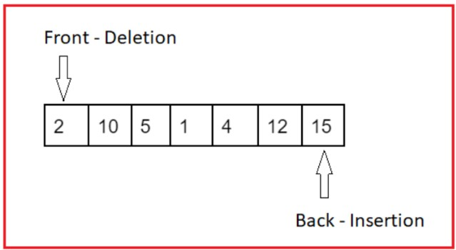

It can be implemented with the help of an array and two variables - front and back. We increment the front variable for deletion and back for insertion. For an array of size N.

Underflow: front > back

Overflow: back == N-1

But it may not be the most efficient implementation of the queue as it may show overflow even when space might be left in the array.

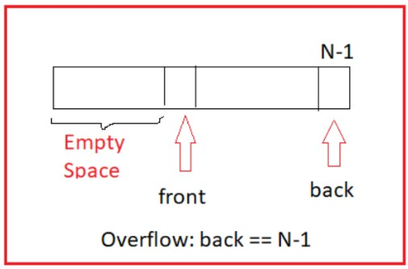

### Circular Queue
Since the simple array implementation of a Queue is not efficient. Therefore, we implement it in the form of a Circular Queue. It is a linear data structure that follows the FIFO (First In First Out) principle. Here, the back end is connected back to the front end to make a circle.

The elements from the front(f) to back(f) form the elements of the queue.

b (back) = (b+1)%N

f (front) = (f+1)%N

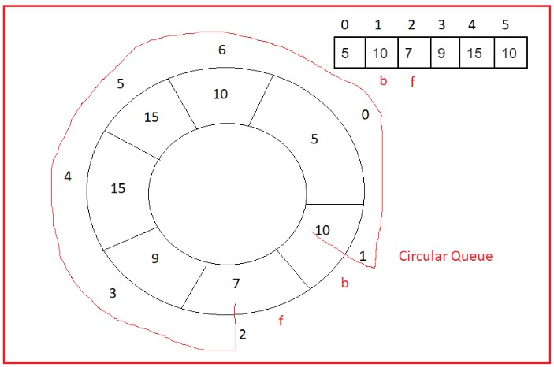

## Overflow: 
f = (b+1)%N

We can also create a count variable “cnt” to keep track of number of elements inserted in the circular queue such that -

cnt == 0 (underflow)

cnt == N (overflow)

### Inbuilt Queue

Languages like C++ and Java provide an in-built queue in their library. The Standard Template Library of C++ provides the following functions.

queue<int> q;              //declares a queue of integers

q.push(100);                //inserts 100 in the queue

q.push(50);

q.push(2);

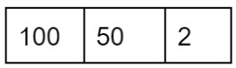

q.pop();   //deletes the front element

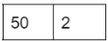

q.size();       //returns size of the queue, here 2

q.empty();  //returns true if the queue is empty

q.front();    //returns the front element of the queue

q.back();   //returns the back element of the queue    

### Design Queue With Stacks
Implement Queue using the basic operations of Stacks. Ignore the overflow and underflow conditions.

    Pushing in the Queue - void push(x);
    q.push(x) ≡ stk.push(x)
    
    Deleting from the Queue - void pop();
    Since deletion in a queue happens from a different end rather than stacks. Therefore, deletion in a stack is not similar to deletion in a queue.
    
    Solution: Use a temporary stack. We can reverse the stack to access the bottom element for deletion.
    
    Time complexity: O(N)
    Space complexity: O(N)
    
    Finding the peek element in the Queue - int peek();
    Note: Peek element is the front element
    We can use a variable to keep a track of the front since the beginning and return the peek element in O(1) time complexity. We can change this variable during deletion.
    
    Checking if the queue is empty - bool empty();
    q.empty() ≡ stk.empty()
    
    Note: pop() can be made O(1) if we use the “top” of the stack for deletion. But optimising pop() will be at a cost of unoptimised push().
## Design Queue With Stacks - 2
    Implement push and pop operation for a Queue using Stacks in O(1) time complexity.
    
    Approach:
    
    If we use a temporary stack for deletion, then all the deletions except the first deletion can be done in O(1) time complexity.
    
    But how we will insert an element in the queue if we are focusing on deleting the elements using a temporary stack?How about exposing the other end of the queue somewhere else?
    
    We can use another stack for performing the push operation. This way we can create two ends using two stacks for insertion and deletion respectively.

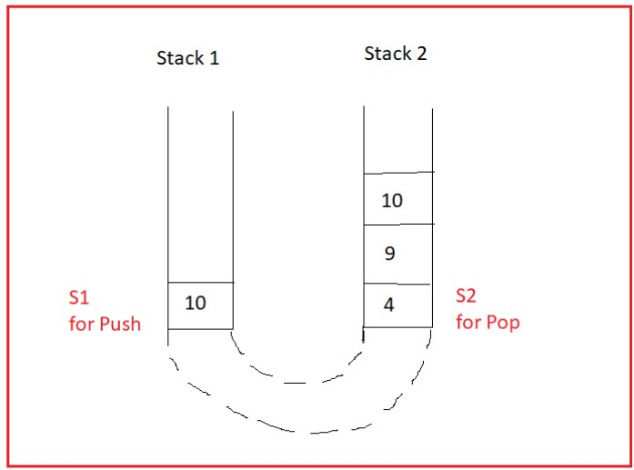

The amortized/average time complexity of the pop operation is O(1).
Amortized time complexity = No. of operations/No. of pop operations
= (O(N) + O(1) + O(1) + … + O(1)) / (N+1)
= O(2N/(N+1))           
≃ O(1) 

### Design Stack With Queues
In this lecture we will learn how to implement stacks using the basic operations of queues.

A stack is a one-ended data structure while a queue is a two-ended data structure. Therefore, we can block one end(say front) of the queue and use the other end(say back) as ‘top’.

q.push(x) ≡ stk.push(x)  Time complexity: O(1)

But how we will delete an element considering there is no provision for deletion from the back end of the queue?

Deletion of the element at the top is only possible if the front reaches there. Thus, we will remove all the other elements (using a temporary queue) and delete the top element when the front reaches the back end.

Time complexity: O(N)

Space complexity: O(N)

### Reverse a Queue

We have been given a queue and we have to reverse its elements.

Input: [10, 20, 17]

Output: [17, 20, 10]

Approach:

Using a stack - The stack works on the principle of LIFO and thus is an easy way to reverse the queue elements. We can insert the elements from the front end to the stack top and then empty the stack sending them to the queue.
Time complexity: O(N)
Space complexity: O(N)

Using recursion - Thinking recursively, we can remove the front element, call the reverse function to reverse the queue and insert the element again.

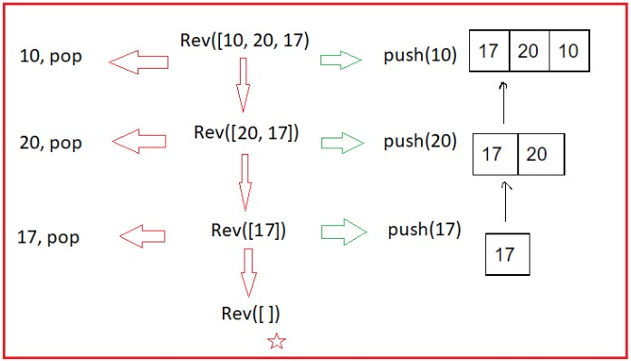

Time complexity: O(N)
Space complexity: O(N)  

### Level Order Traversal
Given a natural number ‘N’. We have to print the first ‘N’ natural numbers whose digits ϵ {1, 2, 3} in a sorted form.

Input: N = 10

Output: 1, 2, 3, 11, 12, 13, 21, 22, 23, 31

Approach:

Thinking recursively - If we have a number ‘num’ that satisfies the given criteria then we can create the next three numbers [ num*10+1, num*10+2, num*10+3] using recursion.

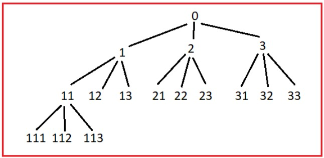

But will this approach work?
No, we will not get the numbers in a sorted manner because recursion works in a depth-based manner.

Level Order Traversal - If you observe carefully, then we can get the elements in a sorted form if we move horizontally.

Can you think of a data structure that can be used for such a purpose?

We can use a queue for level order traversal. We can insert 1, 2 and 3 and then print 1, delete 1 while simultaneously inserting [1*10+1, 1*10+2, 1*10+3]. Similarly, we can get the first N natural numbers containing {1, 2, 3} and in a sorted form.
Time complexity: O(N)
Space complexity: O(N)

Note:
In the worst case, our Queue may store extra elements from the next level even after printing the first N natural numbers. This situation can be optimised using a few checks in the code.
Will level order traversal always produce output in sorted order?
No, it will not. Eg. Consider all numbers with a prime factorisation of the form 2^x.3^y.5^z.

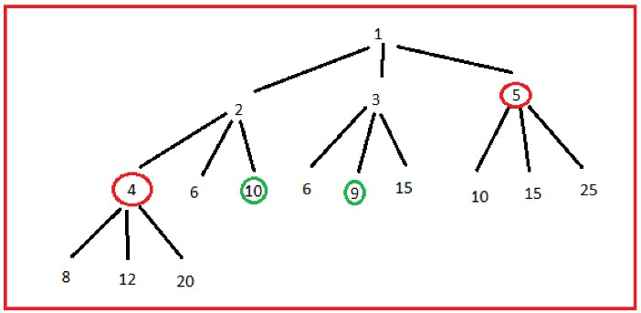

### Binary Forms
Given an integer N>0. Print the binary representation of all numbers from 1 to N.

Input: N = 5

Output: 1, 10, 11, 100, 101

Approach:

Brute Force - We can iterate from 1 to N and produce the binary forms of each one of them respectively.
Time complexity: O(NlogN)
Space complexity: O(1)
Using Level Order Traversal - Can you observe any pattern in the binary representation of numbers?

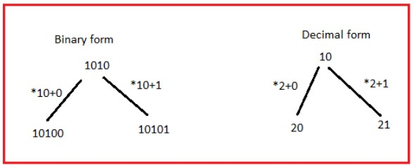

Therefore, if we can store the binary representations in an integer then we can easily produce the binary forms of all the numbers from 1 to N using level order traversal.
Time complexity: O(N)
Space complexity: O(N)

Note:

In the worst case, our Queue may store extra elements from the next level even after printing the first N natural numbers. This situation can be optimised using a few checks in the code.
We may not be able to store the large binary representations in an integer or a long variable, therefore we may have to use strings for the purpose.  

### Doubly-ended Queue
Deque or Double-ended queue is a combination of stack and queue that supports insertion and deletion from both the ends - front and back. It is highly useful in mixed cases where our need may not be fulfilled using either stack or queue.

The common operations on a deque in C++ STL are:

deque<int> q;   //declaration of deque q

d.push_front(x);     //insertion of x at front end

d.pop_front();        //deletion from front end

d.push_back(x);   //insertion of x at back end

d.pop_back();      //deletion from back end

d.front();               //returns the element at front end

d.back();              //returns the element at back end

d.size();                //returns the size of the deque

How will you implement a deque? Do you think using a linked list will be of any help?

### Maximum in Sliding Window
We have been given an integer array Arr[N] and an integer k, k<=N. Find the maximum elements of every subarray of size k.

Input: Arr[7] = {5, -3, 7, 2, 4, 1, 0}

Output: 7, 7, 7, 4

Approach:

Brute Force - Create nested loops to consider all the subarrays of size k and find the maximum element in the subarray.
Time complexity: O((N-k+1)k)

Can we use the concept of a sliding window?
It may look tempting to think of using a sliding window but the approach may not work here as we can not track the change in the maximum element within O(1) time complexity as the window slides.

Let us see an example to understand this approach:

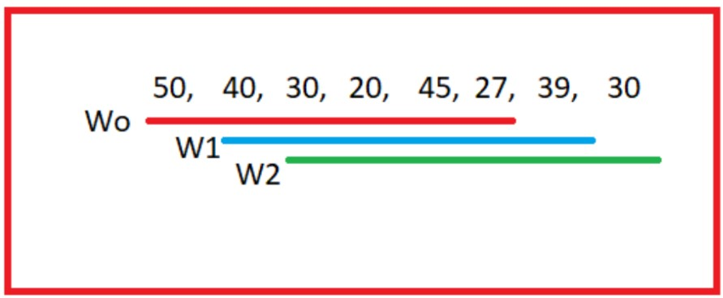

3.1. If you iterate across the elements of the first window (Wo), then 50 can be the possible answer for the first subarray but 40, 30, or 20 can never be the maximum elements of the subarrays they are a part of because all such subarrays will surely contain 45.

3.2. Taking hints from the above, we can build a monotonically decreasing queue. We can insert an element Arr[i] in the queue and remove the preceding elements of the queue while Arr[i]>=q.back(). Since a queue allows deletion only from the front, therefore, we will use a doubly-ended queue for this purpose.

3.3. After traversing the first window, the state of the queue will be:

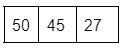

3.4. We know that 50 is not a part of the second window therefore it can not be the maximum and hence it needs to be deleted from the queue.

3.5. We can follow this approach to find the maximum(front of the monotonically decreasing doubly ended queue) for each window. 

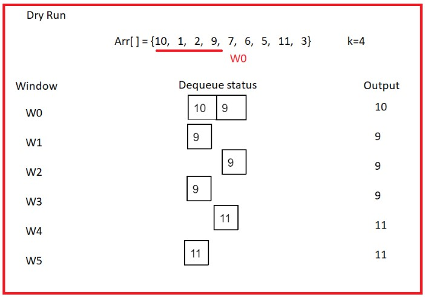

Time complexity: O(N)
Space complexity: O(k) //Maximum number of elements a dequeue can contain

### Maximum in Sliding Window - 2
In this part, we will see how to code the approach discussed in the previous lecture.

Note: Ensure that the deletion operation is not performed on an empty dequeue.

### First Negative Integer
We have been given an integer array Arr[N] and an integer k, 0<k<=N. Find the first negative integer in every subarray of size k.

Input: Arr[6]  = {6. -2, -1, 7, 9, -3}. k=4
Output: -2, 0, 0, -1

Note: In case a subarray contains no negative element, print zero

Approach:

Brute Force - Create a nested loop to consider all the subarrays of size k and find the negative element in the subarray.
Time complexity: O((N-k+1)k)

Using Queue - Here, the positive numbers are useless for us. Therefore, we can keep storing the negative elements in a queue, such that for each subarray the first element of the queue will be the required answer.
Time complexity: O(N)
Space complexity: O(N) 

### Questions:
1. https://www.geeksforgeeks.org/problems/first-negative-integer-in-every-window-of-size-k3345/1
2. https://leetcode.com/problems/sliding-window-maximum/description/
3. https://www.geeksforgeeks.org/problems/generate-binary-numbers-1587115620/1
4. https://leetcode.com/problems/longest-continuous-subarray-with-absolute-diff-less-than-or-equal-to-limit/description/
5. https://leetcode.com/problems/shortest-subarray-with-sum-at-least-k/description/
6. https://www.geeksforgeeks.org/problems/circular-tour-1587115620/1
7. https://leetcode.com/problems/design-front-middle-back-queue/description/
8. https://dashboard.programmingpathshala.com/renaissance/topics/homework?module=3&topic=12&homework=41
9. https://leetcode.com/problems/design-circular-deque/description/
10. https://leetcode.com/problems/design-circular-queue/description/
11. https://leetcode.com/problems/implement-queue-using-stacks/description/
12. https://www.geeksforgeeks.org/problems/queue-reversal/1
13. https://leetcode.com/problems/implement-stack-using-queues/description/
14. https://leetcode.com/problems/implement-queue-using-stacks/description/
15. https://www.geeksforgeeks.org/problems/implement-queue-using-array/1

