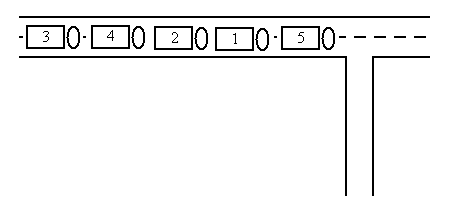
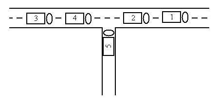
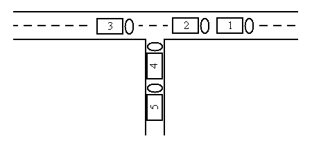
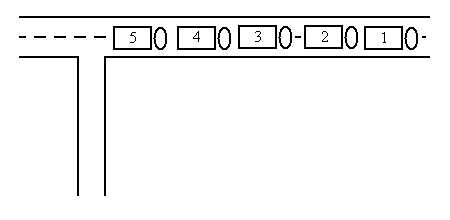

For sure, the love mobiles will roll again on this summer's street parade. Each year, the organisers decide on a fixed order for the decorated trucks. Experience taught them to keep free a side street to be able to bring the trucks into order.

The side street is so narrow that no two cars can pass each other. Thus, the love mobile that enters the side street last must necessarily leave the side street first. Because the trucks and the ravers move up closely, a truck cannot drive back and re-enter the side street or the approach street.

You are given the order in which the love mobiles arrive. Write a program that decides if the love mobiles can be brought into the order that the organisers want them to be.

Input
There are several test cases. The first line of each test case contains a single number n, the number of love mobiles. The second line contains the numbers 1 to n in an arbitrary order. All the numbers are separated by single spaces. These numbers indicate the order in which the trucks arrive in the approach street. No more than 1000 love mobiles participate in the street parade. Input ends with number 0.

Output
For each test case your program has to output a line containing a single word "yes" if the love mobiles can be re-ordered with the help of the side street, and a single word "no" in the opposite case.

Example

Sample input:
5
5 1 2 4 3
0

Sample output:
yes

Illustration
The sample input reflects the following situation:

The five trucks can be re-ordered in the following way:

