What is a Stack
Stack is a linear data structure that follows the LIFO (Last In First Out) principle. It is a one-ended data structure therefore both insertion and deletion takes place from the same end represented by a variable “top”.

Common application of stack includes - Recursion call stack and Undo/Redo operations.

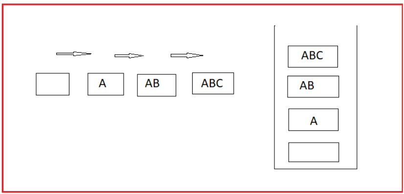

A stack can be uniquely identified by an array and a top variable. Some common operations on a stack includes:

      `bool isFull() - returns true if the stack is full.
      
      bool isEmpty() - returns true if the stack is empty.
      
      void push(x) - inserts an element x at the top of the stack.
      
      void pop() - deletes the top element of the stack.
      
      int top() - returns the top element of the stack.`

The following two situations can arise with a static array implementing a stack.

### Overflow: when top=N-1, 
It will lead to an overflow in case of insertion in a stack of size N.
### Underflow: when top=-1, 
It will lead to underflow in case of deletion.
Note: In-built stacks in language libraries are expandable and thus overflow cases are rare. However, we need to handle underflow cases cautiously. 

### Two Stacks in same Array
 Implement two stacks within the same array.

### Approach:

1. We can divide the array into two halves and declare two variables: top1 = -1 and top2 = N/2-1. We can then implement all the other functions of the stack in the array.

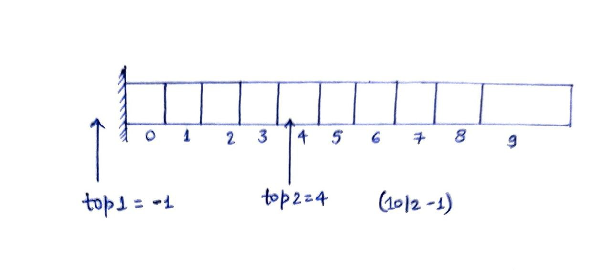

Limitation: It may lead to wastage of space as we may not be able to insert in an overflowed stack even if there is
plenty of space left in the array.

2. We can assign top1=-1 and top2=N and start insertion from the ends of the array.
   Overflow: top1 = top2 - 1

## Push Bottom in a Stack
   We have been given a stack ‘stk’ and an element ‘x’. We have to insert ‘x’ at the bottom of the stack ‘stk’ using only the standard operators of a stack.

If x = 4 and stk is:  

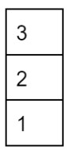

The final stack ‘stk’ should be:
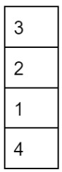

### Approach:

### Iterative: 
We can create an auxiliary stack ‘temp’ and transfer the elements from ‘stk’ to ‘temp’. Once stk is empty, we can insert x & transfer back the elements from temp to stk.
Time complexity: O(N)
Space complexity: O(N)

### Recursion: 
We can break the large problem of push bottom into smaller problems through recursion. We can pop the top element in each step and make a recursion call for a smaller problem, after which we can push the same element again.

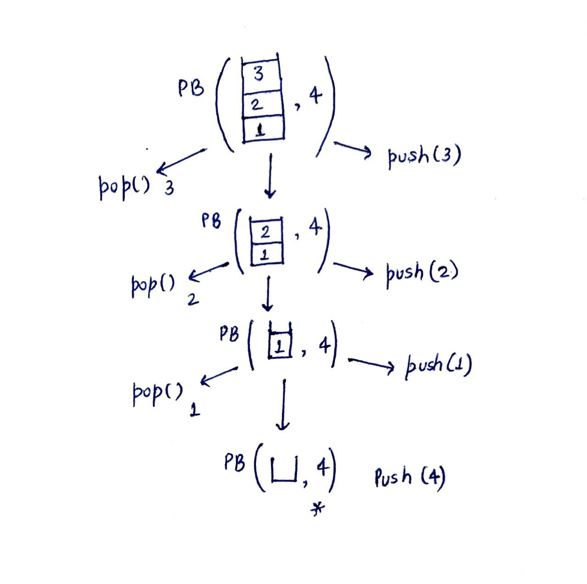

Time complexity: O(N)
Space complexity: O(N)

Note: Any problem that can be solved with the help of a stack can also be solved with the help of recursion and vice-versa.  

### Reverse a Stack
We have been given a stack ‘stk’ and we have to reverse the elements of the stack stk.

Eg. If stk is:

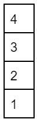

The final stack should be:  

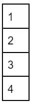

### Approach:

### 1. Using two auxiliary stacks: 
 Since we know that transferring the elements from one stack to another reverses their order. Therefore, we can use two auxiliary stacks to reverse the original elements of the given stack.

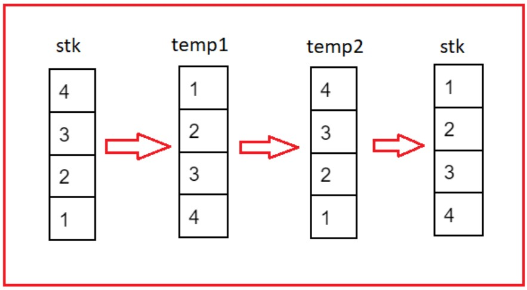

Time complexity: O(N)
Space complexity: O(N)

### 2. Recursion: 
If you remember the push bottom function that we implemented in the previous lecture, then you can easily write its recursive code.
   Time complexity: O(N^2)
   Space complexity: O(N)

### Next Greater Element
We have been given an integer array Arr[N]. We have to find the next greater element of every array element.

Note: Next greater element of an element is the first element which is strictly greater than it and is towards its right.

Input: Arr[4] = {4, 5, 2, 25}

Output: NGE[4] = {5, 25, 25, NULL}

### Approach:

### Brute Force - 
Create two nested loops to find the next greater element for each element respectively.
Time complexity: O(N^2)
Space complexity: O(1)

In the example given below, 5 is the next greater element (NGE) of all the elements from index 1 to 5. Taking a hint from this, can we find an efficient method of assigning 5 as the NGE for the elements from index 5 to 1?

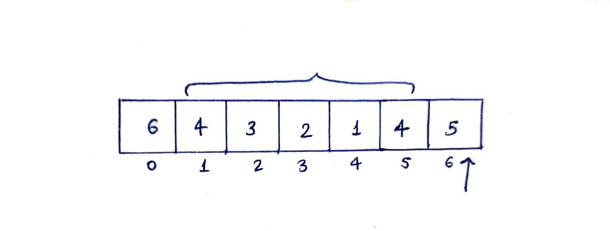

We can utilise a stack for this purpose. We can traverse the array and compare Arr[i] with the stack top. We can assign Arr[i] as the NGE of all the elements it is greater than and then pop them out of the stack. After which we can push Arr[i] into the stack.

Time complexity: O(N)
Space complexity: O(N)

Note: The nature of the stack will always be monotonic-decreasing from bottom to top.

### Largest Area Rectangle
We have been given the height of ‘N’ histograms of width 1 each. Find the area of the largest rectangle.

Input: ht[7] = {6, 2, 5, 4, 5, 1, 6}
Output: 12

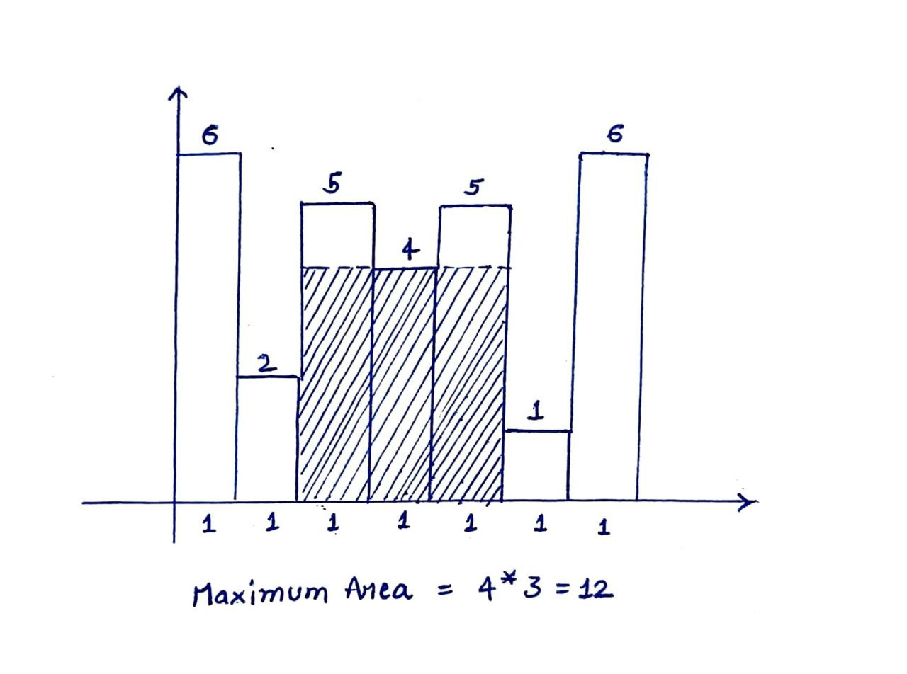

### Approach:

If you think Intuitively, the height of the largest area rectangle will be equal to the height of one of the histograms.

Brute Force - Create two nested loops to consider all possible rectangles for each histogram and keep the track of maximum area rectangle in an answer variable.
Time complexity: O(N^2)
Space complexity: O(1)

Using the concept of Next smaller element (NSE) and Previous smaller element (PSE)

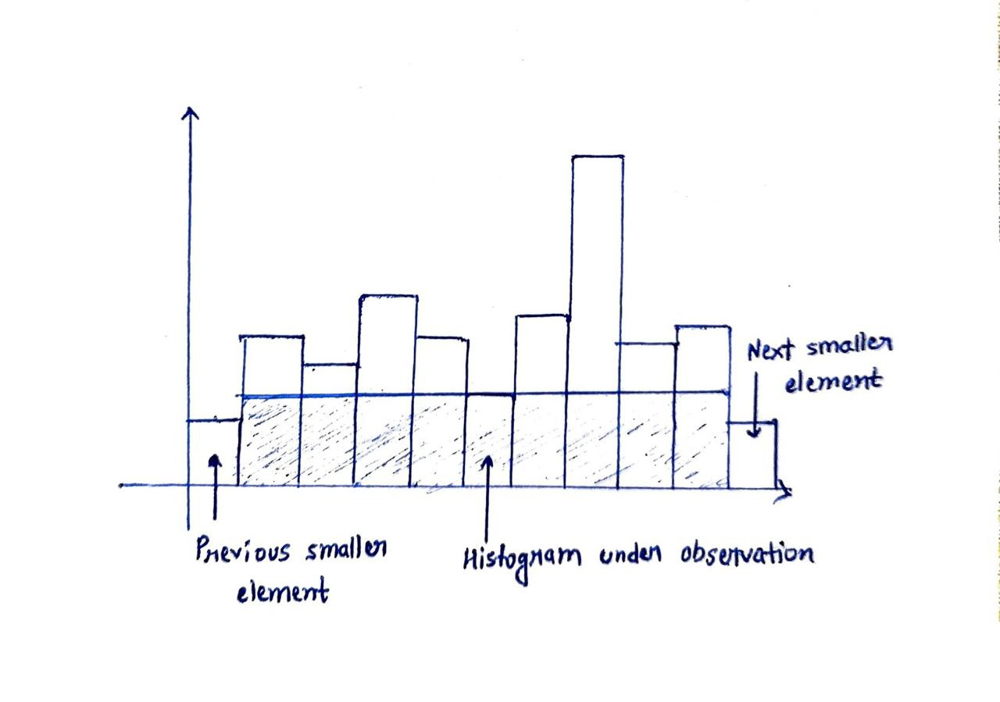

Using stacks we can precompute NSE and PSE for each histogram. After which we can traverse the histogram array to consider the largest area rectangle formed by that particular histogram and compare it with the maximum area variable.
area = ht[i]*(NSE[i]-PSE[i])

Note:

We have stored the index and not the element in the NSE[ ] and PSE[ ] array.
For elements having no next smaller element, we can assign them N.
For elements having no previous smaller element, we can assign them -1.

Time complexity: O(N)
Space complexity: O(1)

### Binary Matrix - 1
We have been given a binary matrix mat[M][N]. Find the maximum area rectangle where all cells

Must be 1
Base must be in the last row

Input: mat[4][4] = {{0, 1, 1, 0}, {1, 0, 1, 0}, {1, 0, 1, 0}, {1, 1, 1, 0}}

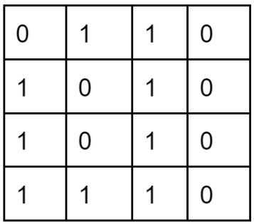

Output: 3

### Approach:

We can use the concept learnt in solving the previous problem on Histograms. All the columns can be regarded as histograms with the last row as the base. Therefore, we can find their heights and use the concept of next and previous smaller elements to compute the answer.

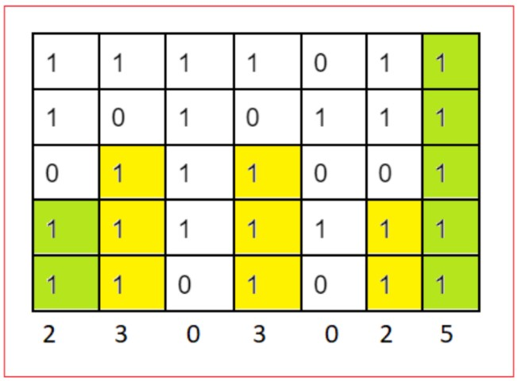

Time complexity: O(M*N)
Space complexity: O(N)

### Binary Matrix - 2
We have been given a binary matrix mat[M][N]. Find the maximum area rectangle such that all the cells in the rectangle contain 1.

Approach:

Taking clues from the previous problem, we can consider all the histograms on each row as bases respectively. We can calculate their heights and apply the concept of the next and previous smaller elements to find the maximum area rectangle.

How to efficiently calculate the heights of the histograms?
We can iterate the matrix column-wise and increment the height when we encounter one otherwise leave it as 0.

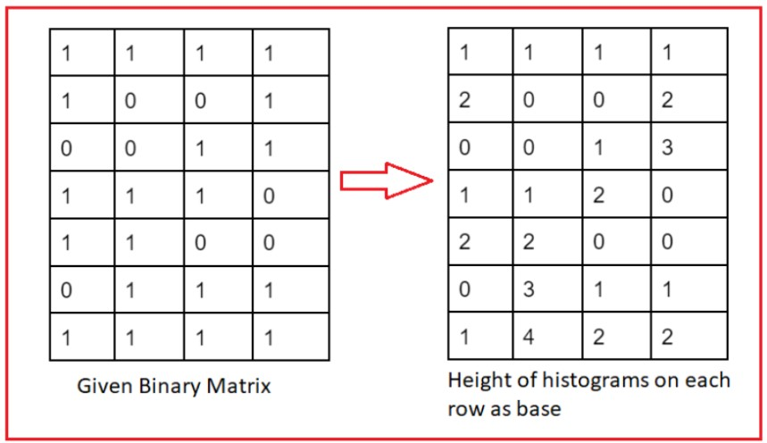

Time complexity: O(M*N)
Space complexity: O(N)

### Sum of Minimums
We have been given an integer array Arr[N]. Find the sum of minimum elements of every subarray.

Input: Arr[4] = {2, 1, 5, 9}
Output: 27

Approach:

Brute Force - Create two nested loops to consider all the subarrays and add the sum of their minimum element to the answer variable.
Time complexity: O(N^2)
Space complexity: O(1)                                   

#### Reverse Lookup - Instead of considering all the subarrays we can consider the contribution of a particular element as shown in the illustration:

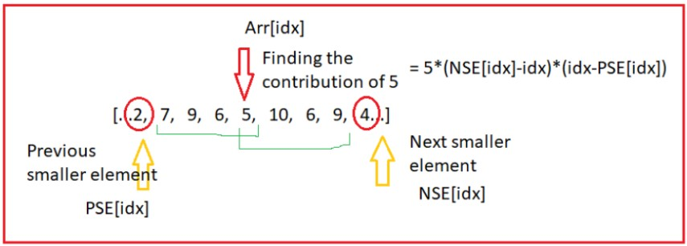

We can find the index of the previous and next smaller element for each array element. After that, we can apply the Rule of Products to find the total number of subarrays containing Arr[i] as the minimum element and respectively calculate its contribution.

Contribution = Arr[i] * (NSE[idx]-idx) * (idx-PSE[idx])

Note: Edge case - Can there be any problem if the array contains duplicate elements?

In the case of repetition, there are chances that the contribution of an element may get added multiple times leading to a greater value of the answer than expected

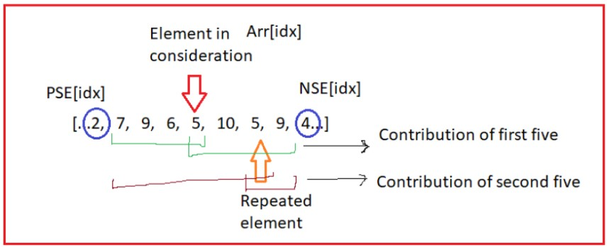

=> It can be handled by calculating the index of the previous element smaller or equal to the current element and the next greater element.

We have stored the index and not the element in the NSE[ ] and PSE[ ] array.
For elements having no next smaller element, we can assign them N.For elements having no previous smaller element, we can assign them -1.

Time complexity: O(N)
Space complexity: O(N) 

### Remove Duplicates
We have been given a string containing only lowercase alphabets. We have to remove the duplicate letters such that:

Every letter comes exactly once
The resultant string is lexicographically smallest
Input: cbacdcbc

Output: acdb

Approach:

If you carefully observe, we are stripping a character if it appears later in the string and the element after it is lexicographically smaller. We can traverse the string, and check if the character is present in the stack, if it is, then we should try to sweep all the larger elements that appear in the string later. For this, we can maintain a frequency array and decrease the frequency of the element as we encounter them in the array.

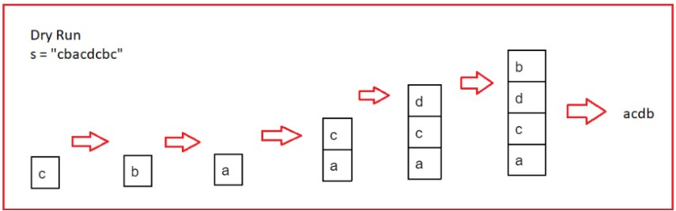

Time complexity: O(N)
Space complexity: O(N)

Design Min Stack
Design a stack that supports the following operations - push(x), pop(), top(), getMin(). The getMin() function returns the minimum element present in the current stack.

We have earlier implemented push(x), pop(), top(), so let’s try to implement the getMin().

Approach:

We can read the elements of the sack by using a temporary stack. We can then return the minimum element present in the stack.
Time complexity: O(N)
Space complexity: O(N)

Can we do it in a better time complexity?

We can use an extra array to store the respective minimum elements. This way we will be able to answer even if our current minimum element is popped out off the stack.

Note: If you are using the stack provided by the language library then you can use stack<pair<int, int>> to store the element and the current_min together.

Time complexity: O(1)
Space complexity: O(N)
Design Min Stack Efficiently
In this lecture, we will see how we can implement the getMin() in O(1) time and space complexity.

Approach:

If you observe carefully, then there are some points of change in the stack where the minimum value changes. Thus, if we can somehow know these points then it will become easy to find the minimum value in the current stack.

We can try to encode both curr_min and prev_min at these points of change of minimum.
Point of change = curr_min + prev_min
It may not help as we may not be able to identify the point of change from other elements of the stack.
Point of change = curr_min - prev_min
Here, we may think that it will be easy for us to find the point of change as curr_min<curr_min - prev_min. But it may not be true in cases where both prev_min and curr_min are negative.
Point of change = curr_min + (curr_min-prev_min)
Since we know that (curr_min - prev_min) will always be negative, thus Point of change < curr_min. This way we can easily identify the point of chan