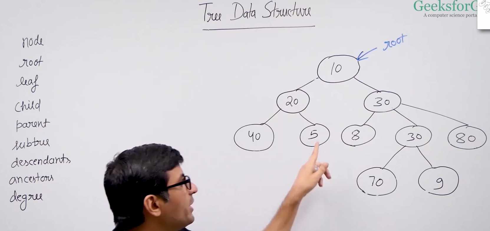

**descendants:**
descendant of 20 are 40 and 5 means all node lies under that

**degree of a node:**

Degree of a node is the number of children it has e.g.
degree of 30 3
degree of 20 is 2

**Note:** leaf node has degree of zero

**Binary Tree:**  Every node has at-most two children.

degree of a node max 2 means either 0, or 1 or 2

