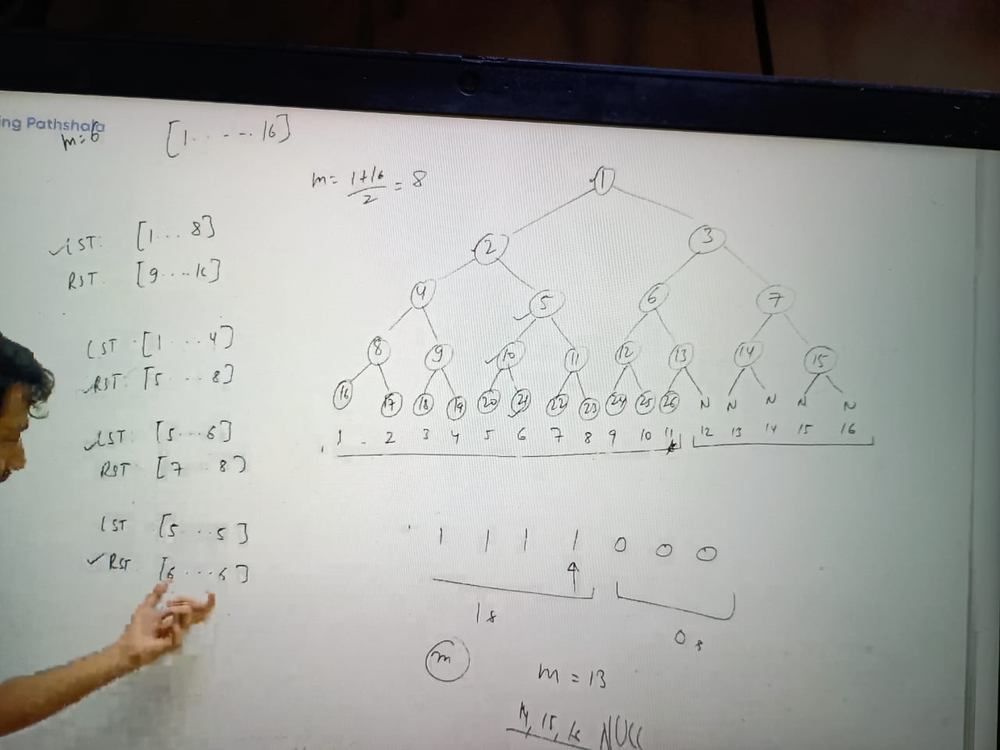

1. Such kind of graph which doesn't have cycle can consider as Tree

### Relation of node and edges
1. if we increment a  node, we have to increment edges by 1

### rooted and un-rooted Tree
1. if edges are bidirection in that case any node can be root node so it called un-rooted Tres
2. Whereas if edges are uni-direction(directed) then we have only one root which called rooted Tree
3. skewed Three: example is linked list which has single branch only

### Binary Three: 
 1. Node can have 2 children
     
                     O - 0
                    / \
                   O   O - 1
Total node in Tree = 2^0 + 2^1 + 2^3....2^i
                   = a(2^n -1) / r-1
                   = 2^(i+1) -1
                   = 2 ^ (1+1) -1 = 3 

Node on a level = 2^i

if number of node 2^(i+1) - 1 then number of level = log of i base 2 = log2^2i = ~i
means hight of BT = log(i)  

Assignments:
https://leetcode.com/problems/symmetric-tree/description/
https://www.geeksforgeeks.org/problems/mirror-tree/1
https://leetcode.com/problems/sum-of-left-leaves/description/
https://www.geeksforgeeks.org/problems/count-leaves-in-binary-tree/1
https://leetcode.com/problems/same-tree/description/
https://leetcode.com/problems/find-a-corresponding-node-of-a-binary-tree-in-a-clone-of-that-tree/description/
https://leetcode.com/problems/count-good-nodes-in-binary-tree/description/
https://leetcode.com/problems/sum-of-nodes-with-even-valued-grandparent/description/

### Count the node into non perfect complete BT:

              

