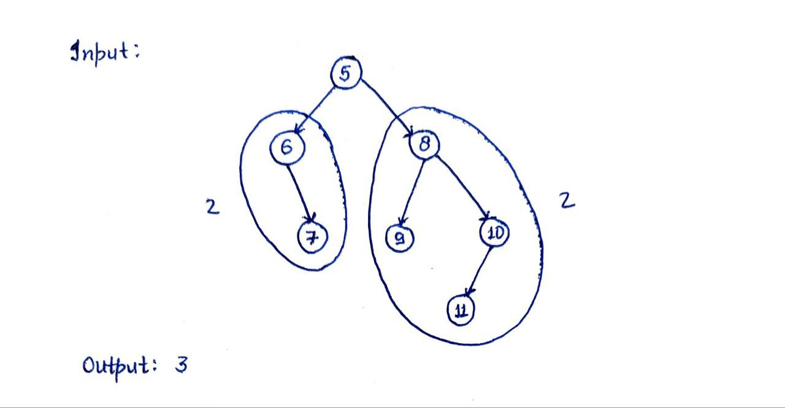
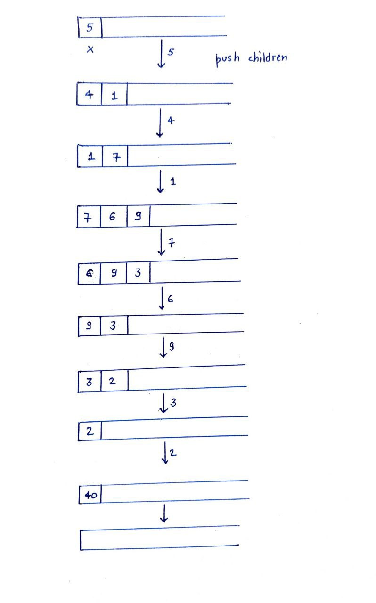
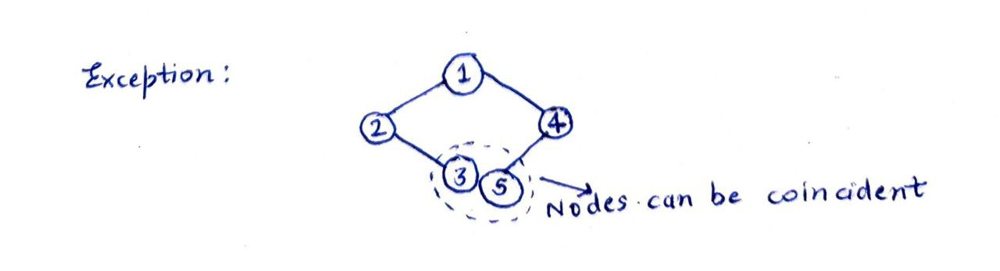
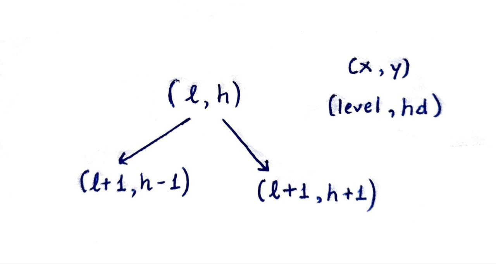
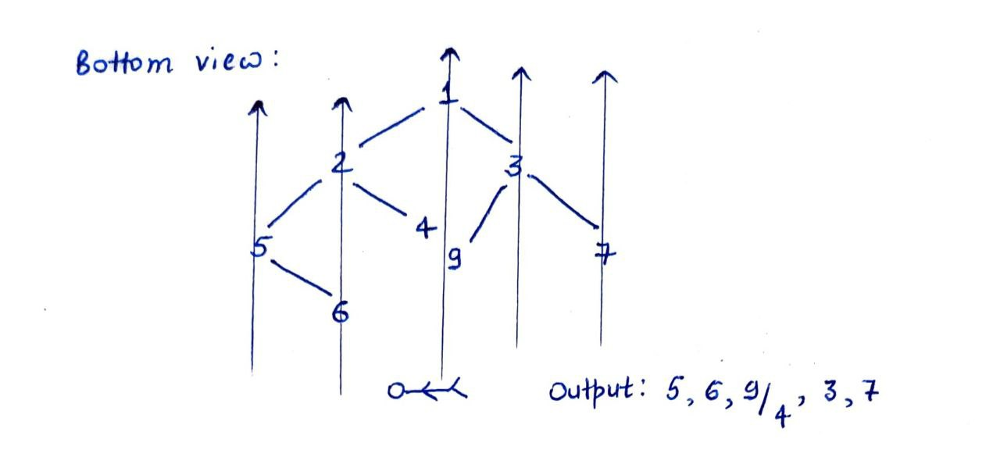
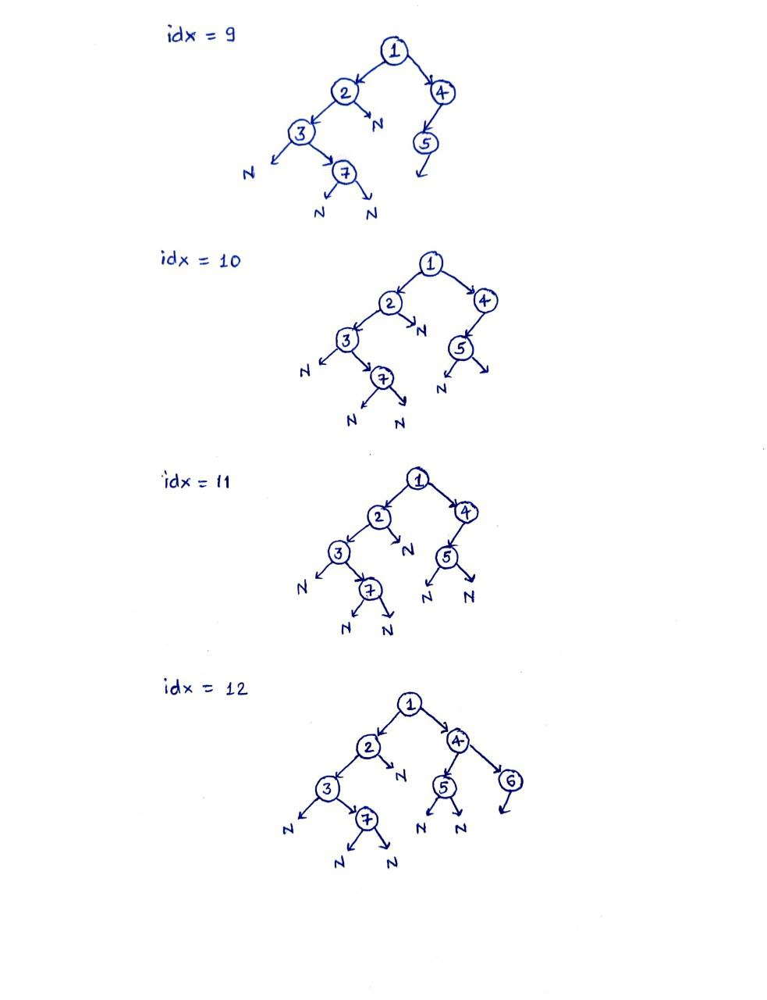
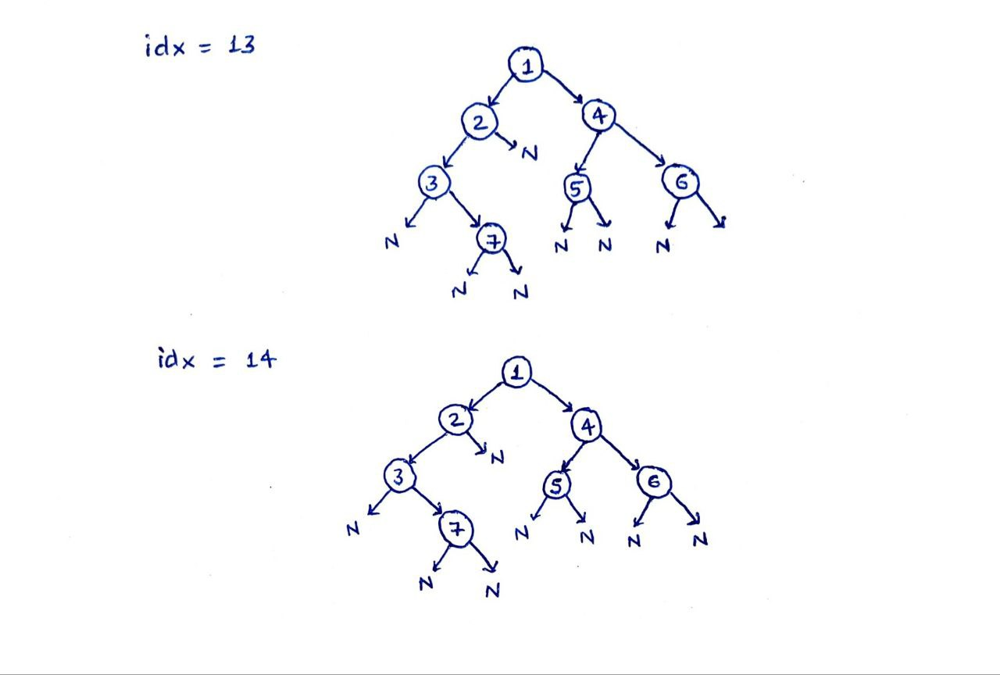
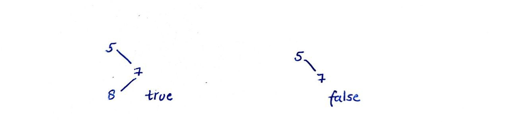
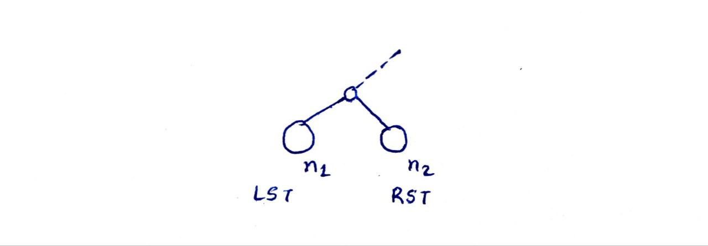

### What are Trees
Till now, we have seen several linear data structures like arrays, linked lists, stacks etc. In this module, we will learn about a hierarchical data structure known as Trees. It consists of a collection of nodes such that each node stores a value, and a list of references to the children nodes.

There are two types of nodes -

### Leaf node: 
A node is a leaf node if it has no children.
### Non-leaf node: 
A node with 1 or more children is known as a non-leaf node.

### Properties of Trees:

Trees are acyclic graphs with no closed cycle.
Trees have a unique path between any two nodes.
A tree with N nodes has N-1 edges.
Trees are inherently a recursive data structure since every subtree of a tree is also a tree. We can use this property to apply the divide and conquer algorithm on trees.


### Rooted Vs Unrooted Tree

A tree that contains bidirectional edges is an unrooted tree since any node can be chosen as a root. While a tree containing directional edges is a rooted tree since it has a fixed root.

### Skewed Tree

A skewed tree is a type of tree in which all the nodes have only one child or no child. Linked lists are also an example of skewed trees.

### Binary Tree

A tree whose nodes can have at max 2 children.


A skewed binary tree will have the maximum number of levels.

=> N nodes containing N levels.

A perfect binary tree will have the minimum number of levels.

=> N nodes containing logN levels.

Total Nodes in a tree with ‘i’ levels = 2^0 + 2^1 + 2^2 + … + 2^i = 2^(i+1) - 1

Number of nodes in the last level ~ ½*(Total nodes)

A binary tree consists of a collection of nodes such that each node contains a value and two references.


```struct Node{

 int data;

 struct Node* left;

 struct Node* right;

}
```
### Counting Nodes
Given a binary tree, count the total number of nodes that it contains.


### Approach:

### What do you mean by “Given a binary tree”?

It means that we have been given the address of its root.


**Using Recursion** - We can divide the tree into two parts - left subtree (LST) and right subtree (RST).


**Recurrence relation:** CountNodes(root) = 1 + CountNodes(root->left) + CountNodes(root->right)

**Termination condition:** if(!root) return 0;


Time complexity: **O(N)**

Space complexity: **O(H)** where H is the height of the given tree


### Counting Leaves
Given a binary tree, count the number of leaves that it contains.


### Approach:

**Using Recursion** - We can divide the tree into two subparts - LST and RST and use recursion to find out the total number of leaves.

### Termination condition: 
``` if(!root) return 0;    //for cases with 1 child
       if(!root->left && !root->right) return 1;   //for leaves
 ```

**Recursive call:** return CountLeaves(root->left)+CountLeaves(root->right);

**Time complexity:** **O(N)**

Space complexity: **O(H)** where H is the height of the given tree

### Mirror Image of Binary Tree
Given a binary tree, convert it to its mirror image.


### Approach:

**Using Recursion -** We know that the right and left children of all the nodes are reversed in the binary image. Therefore, we can reverse the binary tree recursively by dividing it into left and right subtrees.

Let Mirror(node) be the recursive function then, we have to perform the following steps.

Swap LST & RST children
Mirror (node->left)
Mirror (node->right)
**Termination condition:** if(!root) return;   //No need to return for null children

Time complexity: O(N) //each node is touched at max one time
Space complexity: O(H) where H is the height of the tree

### Symmetric Binary Tree
Given a binary tree. Check if it is symmetric.


### Approach:

We know that a binary tree is symmetric if it is similar to its mirror image. Thus, we can create a copy of the given tree, and find its mirror image. We can then compare the two to find if the given binary tree is symmetric or not.
**Note:** The above approach is not preferable as it takes an extra O(N) space complexity.

**Using Recursion -** We can recursively compare the LST(root1 - r1) and RST(root2 - r2)  to find if the given tree is symmetric or not.


### Recurrence relation:
areMirrorImage(r1, r2) = (r1->val == r2->val) && areMirrorImage(r1->left, r2->right) && areMirrorImage(r1->right, r1->left)


### Termination condition:
if(!r1 && !r2) return true;  //if both are null then they are symmetric
if(!r1 || !r2) return false;    //if only one is null then they can not be symmetric

Time complexity: O(N)
Space complexity: O(H) where H is the height of the given binary tree

### Height of Binary Tree
Given a binary tree, find its height.


The height of a binary tree is the maximum path length from the root to the leaf nodes. It can be calculated as the number of nodes or the number of edges. We will use the number of nodes to denote the height of the binary tree.

### Approach: Using Recursion


### Recurrence Relation:
Ht(root) = 1 + max(Ht(root->left), Ht(root->right));


Termination condition: if(!root) return 0;

Time complexity: O(N)
Space complexity: O(H)

2.  **Alternative Recursive approach:** The node that has the maximum level, its level will correspond to the answer. So, if we can use recursion and as we reach the leaf that has a greater level than the answer, we can update the answer.

### Minimum Height of Binary Tree
Given a Binary Tree, find the minimum height of the binary tree.



Minimum height of a binary tree is the smallest path length from the root to the leaf node.

**Approach:** Using Recursion

**Recurrence relation:** minHt(root) = 1 + min(minHt(root->left), minHt(root->right));

Termination condition: if(!root) return 0;
**Will this approach always work?**

No, since a node with one null child and a non-null child will always return the min value as 0. Which will lead to wrong output. Look at the below example -


What if we return INT_MAX on the termination condition. This way we will get the actual value on non-leaf nodes having a null child.


But this also creates a problem for leaf nodes, as it returns INT_MAX. To correct it, we can have a separate condition for leaf nodes, such that they return 0.

Note: The above code may not work if the root is itself null, we can counter this situation by creating a check on the driver function.

```
if(!root)

   return 0;

return minHt(root);
```


### Root to Leaf Paths
Given a binary tree, print all the root to leaf paths.


### Approach: Using Backtracking

We can pass the vector by reference and at each node -

Do: Push node->val to the vector
Recurse: rect(LST)
rect(RST)
Undo: Pop node->val from vector
**Will this approach always work?**

No, since it is terminating at null. Therefore, it will end up printing the same path twice.

=> It should terminate at the leaf.

Also, it can give completely wrong outputs in some cases.


Thus, if the current node is null, we need not do anything. If the current node is a leaf node then we can print the content of the vector.


Time complexity: **O(NlogN)**

Space complexity: **O(H)**

### Diameter of Binary Tree - 1
Given a binary tree. Find its diameter.


Diameter is the longest path between any two nodes.

Is it necessary that the nodes connected by any diameter will always be the leaf node?
Not necessary, It can also be the root and the leaf node.


Can we think of an approach similar to the previous one?
dia = 1 + ht(LST) + ht(RST)


Does it mean that the root will be the part of the diameter?
No, for example -


### Approach:

The easiest way is to write a code that traverses through the tree and for each node, we can call getht( ) to get h1 and h2 and find the maximum diameter when that node is a turning point.
Drawback: At each node, we are not doing a constant operation.
h1 = getHt(N->left); h2 = getHt(N->right)

Can we write a function that can divide the problem into subproblems for the left and right sub-trees? On doing so, the following cases arise -
Binary Tree


It passes through the root
It is entirely contained in LST
It is entirely contained in RST

Diameter = max(d1, d2, 1+h1+h2)

``` 
int getDia(Node* root){ if(!root) return 0;
  return max(1+getHt(root->left)+getHt(root->right), getDia(root->left), getDia(root->right));
}
```


Time complexity: **O(N^2)** //worst-case scenario will be in the case of a skewed tree.
Space complexity: **O(H)**

### Diameter of Binary Tree - 2
In this lecture, we will learn another method to calculate the diameter of a binary tree.

The problem in the previous approach was that a node was touched by all the getHt() calls made by its parent node, leading to redundant work.

Can we somehow get the height of all the subtrees during this call only?

Hint: Values are returned from bottom to top


∴ lh = 1+ max(lh1, lh2)

Before returning it, can we not store it somewhere?


We can use maps (Node* -> int) for precomputation on trees for finding their heights.

```
int getHt(Node* root, unordered_mam<Node*, int>& height){

  if(!root) return 0;

  int lh = getHt(root->left, root->right);

  int rh = getHt(root->left, root->right);

  Heights[root]=1+max(lh, rh);

  return 1+max(lh, rh);

}

int getDia(Node* root, unordered_mam<Node*, int>& height){

  if(!root) return 0;

  return max(1+height[root->left]+height[root->right], getDia(root->left, height),
getDia(root->right, height));

}

```


Time complexity: O(N)
Space complexity: O(N)

### Diameter of Binary Tree - 3
In the previous lecture, we saw a more time-efficient method but it had O(N) space complexity. Can we optimize it further?

Hint: Is a map really required? Can we somehow incorporate the getDia method in getHt()?


```
int getHt(Node* root, int& ans){

   if(!root) return 0;

   int lh=getHt(root->left, ans);

   int rh=getHt(root->right, ans);

   ans=max(ans, 1+lh+rh);

}

//Driver function

int ans=0;

getHt(root, ans);

return ans;

```


### Another technique:

We can return a pair <int, int> containing the height of the subtree and its diameter.


```
pair<int, int> getDia(Node* root){

   if(!root) return{0, 0};

   pair<int, int> lst=getDia(root->left);

   pair<int, int> rst=getDia(root->right);

   int h=1+max(lst.first, rst.second);

   int d=max(1+lst.first+rst.second, lst.first, rst.second);

   return {h, d};

}

int main(){

   return getDia(root).second;

}

```

### Height Balanced Binary Tree
Given a binary tree, check if it is height-balanced or not.

A tree in which the left & the right subtree of every node does not differ by more than 1 unit in height is called a height-balanced tree.

|ht(LST) - ht(RST)| <= 1


### Approach:

**Brute Force -** We can go node by node and check the difference of h1 and h2 for each node.
Drawback: It is a time consuming task and in the worst case scenario - skewed tree, the time complexity will be O(N^2).

**Hint:** Recursion returns from bottom to top.
We can create an “ans” variable and analyze it as true, it can be made false whenever the condition fails.


``` 
int getHt(Node* root, bool& ans){if(!root) return 0;
int lh=getHt(root->left, ans);
int rh=getHt(root->right, ans);
if(abs(lh-rh)>1)ans=false;
return 1+max(lh, rh);
}


int main(){
bool ans = true;
getHt(root, ans);
ret ans;
}


```


**Time complexity:** O(N)
**Space complexity:** O(H)

3.  Return a pair technique -


```
pair<book, int> CHB(Node* root){
    if(!root) retur{true, 0};
    pair<bool, int> lst=CHB(root->left);
    pair<bool, int> rst=CHB(root->right);
    bool f=lst.first && rst.first && abs(lst.second-rst.second)<=1;
    int h = 1+max(lst.second, rst.first);
    return {f, h};
}

```

### Maximum Sum Path
Given a binary tree. Find the maximum sum path under the constraint that it should not be empty.


### Approach:

Think how we used to calculate diameter. Can we somehow use the same idea to calculate the maximum sum path?


A path is something that takes a turn around a turning point. So can we consider all nodes as a turning point?

The maximum sum path can either -

Take a turn about root
Completely contained in LST
Completely contained in RST

### If we know the max sum path in LST and RST, can that help us in finding the max sum path?
No! As it can be seen from the below example.


So what information is required to find the maximum sum path?
Hint: We can find the maximum sum unidirectional path (contiguous sum path)
Key idea - We should be able to return the maximum sum unidirectional path from both LST and RST of a node.


```
pair<int, int> getMaxPath(Node* root){
    if(!root) return{INT_MIN, 0};
    pair<int, int> lst = getMaxPath(root->left);
    pair<int, int> rst = getMaxPath(root->right);
    int max_sum_path = max({root->val+max(0, lst.second)+max(0, rst.second),
    lst.first, rst.first};
    int max_uni_path = root->val + max({0, lst.second, rst.second});
    return {max_sum_path, max_uni_path};
}

```


Time complexity: O(N)
Space complexity: O(H)

### Binary Tree to Doubly Linked List
We have to convert the given binary tree into a doubly-linked list without using extra space. We have to return the head of the final doubly linked list.

Here we are trying to convert one data structure into another and it is possible only when both the data structures have a similar schema, as in the given problem.

#### Binary Tree:

```
struct Node{

   int val;

   struct Node* left;

   struct Node* right;

}

Doubly Linked List:

struct Node{

   int val;

   struct Node* prev;

   struct Node* next;

}
```


Example -


### Approach:

Hint: If we can come up with an approach where we can make the LST and RST a doubly-linked list, then the only work left will be to insert the root in between.


What will we return?
h1 & h2? But we may need t1 and therefore we may have to traverse LST to find t1, which will make the process inefficient. Thus, we can return a pair of head & tail - {h1 t1} & {h2, t2}.
Final head of doubly linked list = h1
Final tail of doubly linked list = t2
Thus we can write a recursive function, where at each node,

    P1 = DLL(node->left);
    P2 = DLL(node->right);
    root->left=P1.second;
    root->right=P2.first;
    P1.second->right=node;
    P2.first->left=node;
But can there be any issue?

Yes, it can lead to run time error due to NULL pointer exception. We can handle it by using the if condition while writing the code.


Termination condition: if(!root)return{NULL, NULL};
Should we always pass the head and tail of the LST and RST?
No, we should not as NULL can not be the head or the tail of LST and RST.
Recursion Tree diagram:


Time complexity: O(N)
Space complexity: O(H)

```
pair<Node*, Node*> convert(Node* root){

  if(!root)return{NULL, NULL};

  pair<Node*, Node*> lst = convert(root->left);

  pair<Node*, Node*> rst = convert(root->right);

  Node* head=root;

  Node* tail=root;

  root->left=lst.second;

  if(lst.second){

   lst.second->right=root;

   head=lst.first;

  }

  root->right=rst.first;

  if(rst.first){

   rst.first->left=root;

   tail-rst.second;

  }

  return {head, tail};

}
```


### All Possible Binary Trees
Given an integer N, generate all the structurally different Binary Trees having ‘N’ nodes.


Input: N=3

Output: [r1, r2, r3, r4, r5]

Input: N=0

Output: []


### Approach:

Can we think of binary trees having ‘N’ nodes on the basis of the number of nodes in LST & RST?
If we can fix the number of nodes in LST then we can easily fix the number of nodes in RST.


Thus, if we can pick all the elements one by one from LST and RST and join them with the root, then we can get all the structurally different binary trees with ‘N’ nodes.
Binary Tree


    vector<Node*> allPossibleBT(int N){

    if(N==0){

      vector<Node*> ans;

      ans.push_back(NULL);

      return ans;

    }
    vector<Node*> ans;

    for(int i=0; i<N; i++){

      vector<Node*> lsts = allPossiblbeBT(i);

      vector<Node*> rsts = allPossibleBT(N-1-i);

      for(int j=0; j<lsts.size(); j++){

        for(int k=0; k<rsts.size(); k++){

          ans.push_back(new Node(0, lsts[j], rsts[k]);

        }

      }

    }
    return ans;

    }

**Drawback:** 
In the above program, we are calculating a particular value multiple times. Therefore, it is an inefficient approach.

### All Possible Binary Trees - 2
In this lecture, we will try to optimize the brute force recursive approach that we followed in the previous lecture to find all the different binary trees with ‘N’ nodes.


We can define C[i] = count of different structures of Binary Trees having ‘i’ nodes

C[4] = C[0]*C[3] + C[1]*C[2] + C[2]*C[1] + C[3]*C[0]

Thus,

C[N] = C[0]*C[N-1] + C[1]*C[N-2] + … + C[N-1]*C[0] i.e.

Catalan Numbers:


this family of numbers is called Catalan Numbers.


So, can we solve this problem in an iterative fashion by solving it from bottom to top?


    vector<vector<Node*>> trees;
    
    trees[0]=NULL;
    
    trees[1]=root;
    
    vector<vector<Node*>> trees;
    
    trees.push_back({NULL});
    
    for(int i=0; i<=N; i++){
    
        vector<Node*> ans;
    
      for(int j=0; j<i; j++){
    
       vector<Node*> lsts = trees[j];
    
       vector<Node*> rsts = trees[i-1-j];
       for(int k=0; k<lsts.size(); k++){
    
          for(int l=0; l<rsts.size(); l++){
    
          ans.push_back(new Node(0, lsts[k], rsts[l]));
    
          }
    
      }
      }
    
    trees.push_back(ans);
    
    }
    return trees[N];
    
    }

### Recursive Tree Traversals
In this lecture, we will learn how to traverse a tree?

Traversing a data structure means touching all the nodes and printing the values present in them one by one.

Let us consider a binary tree to understand the three different types of tree traversals -


Pre-Order traversal - root -> val | LST | RST


    void PreOrder(Node* root){
    if(!root) return;
    cout<<root->val<<” “;
    PreOrder(root->left);
    PreOrder(root->right);
    }

Time complexity: O(N)
Space complexity: O(H)

### In-Order traversal - LST | root -> val | RST


    void InOrder(Node* root){
    if(!root) return;
    InOrder(root->left);
    cout<<root->val<<” “;
    InOrder(root->right);
    }


Time complexity: O(N)
Space complexity: O(H)

### Post-Order traversal - LST | RST | root-> val


    void PostOrder(Node* root){
    if(!root) return;
    PostOrder(root->left);
    PostOrder(root->right);
    cout<<root->val<<” “;
    }


Time complexity: O(N)
Space complexity: O(H)

### Iterative Preorder Traversal
In this lecture, we will learn the iterative approach for Pre-order traversal.

Since we know that recursion involves an internal system stack, therefore we can create our own stack to write an iterative code.


In the above example. f(2) prints the value at f(2) and then calls f(3) and then f(7). And since we know that a stack works on LIFO, therefore we can insert the root->left and root->left after it.

Stack diagram for above example.


    stack<Node*> stk;
    
    stk.push(root);
    
    while(!stk.empty()){
    
       Node* node = stk.top();
    
       stk.pop();
    
       cout<<node->val;
    
       if(node->right)
    
       stk.push(node->right);
    
       if(node->left)
    
       stk.push(node->left);
    
    }


Time complexity: O(N)

Space complexity: O(H)

### A Generic Tree Traversal Technique
As discussed in the previous lecture, we can use a stack for iterative implementation of In-order and Postorder traversal.

**In-Order Traversal:**


From the above diagram, we want to print the value of the root in its II occurrence, and not its I occurrence.

Can we use a flag for this?

Stack diagram -


    stack<pair<Node*, int>> stk;
    
    stk.push({root, 0});
    
    while(!stk.empty()){
    
      pair<Node*, int> p = stk.top();
    
      stk.pop();
    
      if(p.second==1)
    
       cout<<p.first->val<<” “;
    
      else
    if(p.first->right)
    
        stk.push({p.first->right, 0});
    
       stk.push({p.first, 1});
    
       if(p.first->left)
    
        stk.push({p.first->left, 0});
    
    }


Time complexity: O(N)

Space complexity: O(H)

Here, the order is just reversed to what it was during recursion. We can use the same strategy for Post-order traversal with a little change in the code.

    stack<pair<Node*, int>> stk;
    
    stk.push({root, 0});
    
    while(!stk.empty()){
    
      pair<Node*, int> p = stk.top();
    
      stk.pop();
    
      if(p.second==1)
    
       cout<<p.first->val<<” “;
    
      else{
    stk.push({p.first, 1});
    if(p.first->right)
    
        stk.push({p.first->right, 0});
    
       if(p.first->left)
    
        stk.push({p.first->left, 0});
    
      }
    
    }


Time complexity: O(N)

Space complexity: O(H)


Can we think of some approach without using the flag?

### Iterative Inorder Traversal without flag
In this lecture, we will learn how to perform the iterative implementation of Inorder traversal without using a flag.


If you carefully observe, the first element that is printed is either the last node or the leftmost node that has a null pointer on the left.

### Approach:

We can start from the root and iterate to the leftmost node to print it. We can follow a similar approach for inorder traversal.
Will this work? No, it will not as we move to the left we forget the actual path.

Using stacks - From the first approach, we realize the importance of keeping track of the path taken. Thus, we can use a stack to track the path.


    stack<Node*> stk;
    
    Node* tmp = root;
    
    while(tmp){
    
      stk.push(tmp);
    
      tmp=tmp->left;
    
    }
    
    while(!stk.empty()){
    
      Node* p = stk.top();
    
      stk.pop();
    
      cout<<p->val<<” “;
    
      Node* r = p->right;
    
      while(r){
    
       stk.push(r);
    
       r=r->left;
    
        }
    
    }


Time complexity: O(N)

Space complexity: O(H)

Food for thought: Can you think of a way to implement iterative reverse inorder traversal? (RST | root->val | LST)

### Level Order Traversal
In this lecture, we will learn how to perform Level order traversal in a binary tree.


### Approach:

Can we use recursion here?
No, we can not. 

This traversal pattern is not a recursive traversal pattern because recursion works by exploring depth.
**Note:** Recursive traversals are also known as Depth First Search
If you carefully observe, then here we follow an in and out flow.
In -> (level)i -> Out

Which is similar to FIFO. 
Thus, we can use a queue to implement level order traversal.



    queue<Node*> q;
    q.push(root);
    
     while(!q.empty()){
    Node* n = q.front();
    q.pop();
    cout<<n->val<<” “;
    if(n->left)
    q.push(n->left);
    if(n->right)
    q.push(n->right);
    }


Time complexity: O(N)

Space complexity: O(width of tree), where width of tree = maximum no. of nodes that any particular level can have.

The level order traversal problem is also asked in other manners. For example -

Print the nodes of different levels on different lines.


Here we need to keep track of the level at which the node is and also the level that is being printed. Accordingly, we can print a new line.

So, we can use a pair<Node*, int> and curr = 0, to keep track of the level of the node in the queue and also the level that is being printed.


    queue<pair<Node*, int>> q;
    q.push({root, 0});
    int curr = 0;
    while(!q.empty()){
    pair<Node*, int> p = q.front();
    q.pop();
    if(p.second > curr){
    curr = p.second;
    cout<<endl;
    }
    cout<<p.first->val<<” “;
    if(p.first->left)
    q.push({p.first->left, p.second+1});
    if(p.second->right)
    q.push({p.first->right, p.second+1});
    }

But in the above approach, we are using too many integers. Can we somehow do it without using a pair?
If you carefully observe then there are instances where at ith iteration, the queue has both - level i and i+1. Can we somehow get all the nodes of a level at once?

We can empty the whole queue using the q.size() method and print them all at once.

    queue<Node*> q;
    q.push(root);
    while(!q.empty()){
    int sz = q.size();
    while(sz–){
    Node* m = q.front();
    q.pop();
    while(sz–){
    cout<<n->val<<” “;
    if(n->left) q.push(n->left);
    if(n->right) q.push(n->right);
    }
    }
    cout<<endl;
    }


Food for thought: Can you think of how to print the nodes from left to right?

### ZigZag Level Order Traversal
Given a binary tree, perform a zig-zag level order traversal.


Binary Tree
For, Level Li, i%2==0, direction is left to right
                     i%2==1, direction is right to left

### Approach:

Since we know that the nodes in even-numbered levels are printed in FIFO order while the nodes in odd-numbered levels are printed in LIFO order. Thus, we can use a stack for printing the reverse order.

    queue<Node*> q;
    
    q.push<root>;
    
    int level=0;
    
    stack<int> stk;
    
    while(!q.empty()){
    
      int sz = q.size();
    
      while(sz–){
    Node*n = q.front();
    q.pop();
    if(level%2!=0)
    stk.push(n->val);
    
        else
    
         cout<<n->val<<” “;
    
        if(n->left) q.push(n->left);
    
        if(n->right) q.push(n->right);
    
        }
    if(level%2!=0){
    while(!stk.empty()){
    cout<<stk.top<<” “;
    }
    }
    level++;
    
        cout<<endl;
    
    }

Food for thought: Is it possible to solve this problem using a dequeue?

### Left and Right Views of Binary Tree
We have been given a binary tree and we have to print its left view.


Left view of a tree is the set of nodes that will be visible if you are looking at it from the left side.

Approach:

Only the first node of all the levels will be visible to us. This hints us to use level order traversal for solving this problem. While running Linear order traversal we will print only the front of the queue.
Time complexity: O(N)
Space complexity: O(width of tree)

Can we solve it without using any explicit data structure?
Let’s think from the basics -
We know that we can divide a tree into - Root, LST & RST.

If we move first into left then right. In such a case, we will always cover the left node i.e. the left view.
- touching the root
- recurse(root->left)
- recurse(root->right)

The above order mimics pre-order traversal.
**Note:** The first node of ith level in the pre-order sequence will be the leftmost node of ith level. Eg.
Binary Tree


The basic idea is that whenever we see a node with a level that was never seen before then we can simply print that node, as it will be a part of the left view.
Binary Tree


How do we check whether a particular node has been encountered earlier or not? Will using hashmaps be a good idea?
Since we know that if we are at level 9, then we must have checked levels 7 & 8 as we are moving from top to bottom. It means whenever we reach a new level that has not been reached earlier then it is our leftmost node of that level. So, it can be done by using a single variable instead of a hashmap.

    void leftview(Node* root, int l, int& maxL){
    if(!root) return;
    if(l>maxL){
    maxL=l;
    cout<<root->val<<” “;
    }
    leftview(root->left, l+1, maxL);
    leftview(root->right, l+1, maxL);
    }

Time complexity: O(N)

Space complexity: O(H)

Similarly, can you print the right view of the given binary tree?
Hint: It can be done by reversing the order of the recursive calls.
### Vertical Order Traversal - 1
We have been given a binary tree and we want to perform vertical order traversal.


Exception:



In such cases, we can ignore ordering.

Approach:

Can we think of nodes as points on XY coordinates? We can create a pair of (level, hd).



We can start printing form left such that -
Height distance (hd) is minimum
If hd is same then we can print them on the basis of their levels


We can use a struct for this purpose and apply sorting with the help of a custom-defined comparator function.


Time complexity: O(NlogN)

### Vertical Order Traversal - 2
In this lecture we will learn how we can perform vertical order traversal within O(N) time complexity.

### Approach:

If we carefully observe, then all the nodes in a group have the same horizontal distance.
Thus, we can create a map<int, list<int>> and map the list of nodes to its horizontal distance.
-2 : [11]
-1  : [6, 12]
 0 : [5, 7]
 1  : [8, 10]
 2 : [9]
But how will you manage the order of elements in the list?


To maintain order, we have to ensure that we have traveled (i-1)th level before ith level. This reminds us of level order traversal.

    queue<pair<Node*, int>> q;
    q.push({root, 0});
    unordered_map<int, vector<int>> mp;
    int maxx = INT_MIN, minn = INT_MAX;
    while(!q.empty()){
    pair<Node*, int> p = q.front;
    q.pop();
    maxx = max(maxx, p.second);
    minn = min(minn, p.second);
    mp[p.second].push_back(p.first->val);
    if(p.first->left)
    q.push({p.first->left, p.second-1});
    if(p.second->right)
    q.push({p.first->right, p.second+1});
    }
    for(i = minn to maxx){
    v = mp[i];
    print v;
    }

Time complexity: O(N)

Space complexity: O(N)

### Top and Bottom Views of Binary Tree
We have been given a binary tree and we have to print its top view.


### Approach:

We can use vertical order traversal to find all the nodes in a vertical level and print the top most one.
-2  : [9]
-1  : [2, 10]
0  : [5, 1]
1   : [6, 3]
2  : [7]
But we only need the topmost node in each vertical level, so why should we store all the elements of that level in the map? Can we somehow do it without storing a list of nodes?
Since, we know that for a node of a particular horizontal distance h - that is appearing for the first time, that node will be the top most node.

    unordered_map<int, int> M;
    queue<pair<Node*, int>> Q;
    Q.push({root, 0});
    int minn = INT_MAX, maxx = INT_MIN;
    while(!Q.empty()){
    pair<Node*, int> p = Q.front();
    Q.pop();
    minn = min(minn, p.second);
    maxx = max(maxx, p.second);
    if(M.find(p.second) == M.end())
    M[p.second] = p.first->val;
    if(p.first->left)
    Q.push({p.first->left, p.second-1});
    if(p.first->right)
    Q.push({p.first->right, p.second+1});
    }
    for(i = minn to maxx){
    cout<<M[i]<<” “;
    }

Worst case space complexity: O(N)


Can you think of a similar approach for bottom view?

For the bottom view of the binary tree we will always update the map whenever we see a node at horizontal distance h.




### Count of Nodes in Complete Binary Tree - 1
A complete binary tree is a type of binary tree in which all the levels are full except the last level that can be completely or partially full, provided that all its nodes in the last level appear as left as possible.


Q. We have been given a binary tree and we have to count the number of nodes.


If h is the height of the tree, then

2^0 + 2^1 + … + 2^(h-1) = 2^h - 1 Nodes

Now can we figure out the height ‘h’ in less than O(N) time complexity?
∵ All the leaf paths are of same length therefore we can travel to the leftmost leaf path.

Time complexity: O(H) = O(log2N)

### Count of Nodes in Complete Binary Tree - 2
In a complete binary tree every level is full except the last level. For the incomplete last level, the nodes are present as left as possible.


### Approach:

From the below diagram,
### answer = Cnt + last level cnt


What is the maximum possible number of nodes in the last level, for a binary tree of height h?

=> 2h-1

Out of these nodes, some will be null and some will be non-null. Can we use binary search here? Yes, since the nodes in the last level are monotonic in nature.


    high = 2h-1, low = 1

Note: low can not be zero since it is the last level otherwise if it has 0 nodes then it won’t be the last level.

Time complexity for binary search method: **O(logN)**

Because this method took a specific root to leaf path and every path is of height h.

    bool isNULLNode(Node* root, int maxLeavesCount, int mid){
    if(mid>maxLeavesCount) return true;
    int l = 1, h = maxLeavesCount;
    while(h>l){
    m = (l+h)/2;
    if(mid<=m){
    root=root->left, h=m;
    }
    else{
    root=root->right;
    l=m+1;
    }
    }
    return !root;
    }

**Note:** Edge case - If the last level is full, in such a case we will check for m+1 with an if condition.

    int CountNodes(Node* root){
    if(!root) return 0;
    int ht = getHeight(root);
    int maxLeavesCount = getMaxLeavesCount(2, ht-1);
    int low=1, high=maxLeavesCount;
    int mid, ans;
    while(low<=high){
    mid=(low+high)/2;
    bool x = isNULLNode(root, maxLeavesCount, mid);
    if(x) high=mid-1;
    else{
    if(isNULLNode(root, maxLeavesCount, mid+1){
    ans=mid;
    break;
    }
    else
    low=mid+1;
    }
    }
    return ans+maxLeavesCount-1; //From GP formula
    }

Binary Search
    
    int getHt(Node* root){
    int ans = 0;
    while(root){
    ans++;
        root=root->left;
       }
       return ans;
    }
    
    int getMaxLeavesCount(int x, int y){
    if(y==0) return 1;
    int ans = getMaxLeavesCount(x, y/2);
    if(y%2==0) return ans*ans;
    return ans*ans*x;
    }

**Time complexity:** h*log(2^h-1) = h^2 = O(logN)^2


### Count of Nodes in Complete Binary Tree - 3
In this lecture, we will learn a recursive and easier approach to finding the number of nodes in a binary tree.

### Approach:

No. of Nodes = 1+Count(LST)+Count(RST)
If we apply this formula to the complete binary tree, then at least one of the LST or RST will be a perfect binary tree. Therefore, we may not actually need to calculate it for one subtree.

For a perfect tree, No. of nodes = 2^h-1


Here, 1+(2^3-1)+Count(root->right)

How to check if a tree is perfect or not?

Since, we know that the tree is complete so we can directly check the length of its leftmost and rightmost root to leaf path.


Time complexity: O(logN)^2

Space complexity: log(N) //there are logN function calls

    pair<bool, int> isPerfect(Node* root){
    Node* tmp = root;
    int hleft = 0;
      while(tmp){
    hleft++; tmp = tmp->left;
    }
      tmp = root;
    int hRight = 0;
    while(tmp){
    hRight++;
    tmp = tmp->right;
    }
    return {hleft == hright, hleft};
    }
    
    int CountNodes(Node* root){
    if(!root) return 0;
      int cnt = 1;
      Pleft = isPerfect(root->left);
      Pright = isPerfect(root->right);
    is(Pleft.first){
    cnt+=pow(2, pleft.second)-1;
    }
    else{
    cnt+=CountNodes(root->left);
      }
    if(Pright.first){
    cnt+=pow(2, Pright.second)-1;
    }
    else{
    cnt+=CountNodes(root->right);
    return cnt;
    }
    }

### Binary Tree Reconstruction
We have been given the preorder traversal of a binary tree and we have to generate that tree.

Input: {1, 2, 3}

Output:


There can be multiple binary trees with the same pre-order traversals.


For a general example, {a0, a1,.., an-1}


Conclusion: Pre-order is not sufficient to create a unique tree.


Initially, our aim was to generate all the binary trees for the given preorder traversal. But to do that we need to generate all the binary trees whose pre-order traversal is LST & RST.


### Reconstructing Tree from given traversals - 1
If we carefully observe the pre-order, post-order and in-order traversals then,


Thus, we can use a combination of pre-order and in-order to generate the unique tree.


**Note:** Will the above approach work for trees that contain duplicate values?

Here we have assumed all the nodes have distinct values.


### Implementation:

We will create a function that takes the subarrays of preorder and inorder and uses it to create a tree and return its root.
If (i1, j1) and (i2, j2) represent the pre-order & in-order for a binary tree, then we can divide the left tree and right tree as -


    vector<int> Preorder;
    
    vector<int> Inorder;
    
    Node* build(int i1, int j1, int i2, int j2){
    if(i1>j1) return NULL;
    Node* root = new Node(Preorder[i1], NULL, NULL);
    
     int i;
    
     for(i=i2, i<=j2; i++){
    if(inorder[i]==preorder[i1])break;
    }
    root->left = build(i1+1, i1+i-i2, i2, i-1);
    root->right = build(i1+i-i2+1, j1, i+1, j2);
    return root;
    
    }

Time complexity: O(N^2) //we are traversing O(N) every time a new node is generated
   //Total calls to build = N


Can we optimize it further using a data structure?
We can optimize it further by using a map and map.get[Pre[i1]) instead of linear search.

### Reconstructing Tree from given traversals - 2
In this lecture, we will see if we can create a tree using its post order and inorder traversal.


As it can be seen from the above diagram, here the case is just reversed as compared to preorder and inorder traversal. Hence we can follow the same technique to generate the unique tree.


### Reconstructing Tree from Preorder traversal
In the previous few lectures we saw how preorder traversal is insufficient to generate the unique tree.

Can we make some minor changes in the way we preorder traversal works such that we can generate the unique tree from its subarray?

### Approach:

Since we know that the order of preorder traversal is also the order of recursion function calls. Thus, we can try to generate the tree accordingly.


But the problem with the above approach is that we do not know when to come up after reaching a particular depth.


We can not tell if 7 is left child or right child.

Whenever we encounter a NULL, then we have to come up. So, do you think it will be helpful if we include NULL in pre-order traversal?







    //function to add NULL in the preorder traversal of the binary tree
    void PO(Node* root, vector<int>& Pre){
     if(!root){
    Pre.push_back(NULL);
    return;
    }
    Pre.push_back(root->val);
    PO(root->left, Pre);
    PO(root->right, Pre);
    }
    
    //function to generate the unique tree
    Node* makeTree(vector<int>& Pre, int& i){
    if(Pre[i]==NULL){
    i++;
       return NULL;
    }
     Node* n = new Node(Pre[i], NULL, NULL);
    i++;
     n->left = makeTree(Pre, i);
    n->right = makeTree(Pre, i);
     return n;
    }

### Note:

The tree is generated but the only issue is that it contains NULL, which can be easily removed.
Some programming languages may not allow pushing NULL in the vector. So, we may have to think of some programmatic implementation for that. Eg. NULL == 0 or -1 if all nodal values are positive.
### Subtree of a Tree
A subtree of a tree T is a tree S consisting of a node in T and all its descendants in T.


**Note:** An empty tree is also a subtree.


We have been given 2 trees and we have to check if the second tree is the subtree of the first tree.




### Approach:

**Brute Force -** We can compare all the subtrees of the first tree with the second tree to check if the second tree is a subtree of the first tree.
Two trees are same if -

- r1>val == r2-> val
- LST1 = LST2
- RST1 = RST2


    bool areSame(Node* r1, Node* r2){
    if(!r1 && !r2) return true; //both are NULL
    if(!r1 || !r2) return false;
    return r1>val == r2-> val && areSame(r1->left, r2->left) && areSame(r1->left,
    r1->right);
    }


Time complexity: O(N)

    void traverse(Node* r1, Node* r2, bool& ans){
    if(areSame(r1, r2)){
    ans=true;
    return;
    }
    if(!r1) return true;
    traverse(r1->left, r2, ans);
    traverse(r1->right, r2, ans);
    }

Overall Time complexity: O(N^2)

Can we rely on the travel sequence that we get from the first and second tree?

We know that if two trees are the same then their preorder traversal is the same. But the vice-versa is not true.


Thus, to use the above premise, we will attach NULL nodes to the preorder traversal to make it unique.


After finding their preorder traversals we can check if the second preorder traversal is the subarray of the first preorder traversal

The above can be implemented in two ways -
- Brute Force - O((N-M)*M)
- Pattern matching algorithm - Linear time


    vector<int> pre1, pre2;
    traverse(r1, pre1);
    traverse(r2, pre2);
    
    if(pre1.size()<pre2.size) return false; //tree 2 can not be subtree of 1 if it is larger than I
    for(i=0; i=pre1.size-pre2.size(); i++){
    int cnt=0;
    for(j=i; j<i+pre2.size; j++){
    if(pre[j]==pre[j-1]){
    cnt++;
    }
    if(cnt==pre2.size())
    return true;
    }
    }

Time complexity: O(N^2)

### Serialization and Deserialization of Tree
Serialization is the process to convert an object into a sequence of bytes so that it can be stored in memory and transferred to another device.


To transfer a binary tree to another computer, we need to convert it into a binary array - stream of bytes. For this, we will need to store it in the form of a list of nodal values.

              Preorder: [1, 2, 3, 4, 5]
C1 —--------------------------> C2

              Inorder: [3, 2, 4, 1, 5]

Deserialization is the reverse process where the byte stream is used to recreate the actual object in memory.


```Eg.

class Person{

  string name;

   intage;

}
```


The above object can be easily stored in memory as a JSON object as -

    {
    
     “name” : “Jack”;
    
     “age” : “32”;
    
    }

list<int> Serialize(Node* root)

Node* deSerialize(list<int>)

### LCA - 1
All the nodes lying above a particular node in its root to leaf path are called Ancestors of that particular node, including the node itself.


We have been given two nodes and we have to find their lowest common ancestor in a binary tree.

Note: Out of all the common ancestors of two nodes, the one that lies at the deepest level is called LCA. It is also the point of divergence.

6: [1, 2, 4, 5, 6]

3: [1, 2, 3]

LCA(6, 3) = 2

5: [1, 2, 4, 5]

10: [1, 9, 10]

LCA(5, 10) = 1

10: [1, 9, 10]

12: [1, 9, 11, 12]

LCA(10, 12) = 9

7: [1, 2, 4, 5, 6, 7]

4: [1, 2, 4]

LCA(7, 4) = 4

Approach:

We can create path 1 and path 2.

We can store them in a global vector - path1 and path2.

We can check the two vectors for the LCA.

    vector<Node*> path1, path2, tmp;
    
    traverse(root, r1, r2, path1, path2, tmp){
    
      int i = 0;
    
      while(i<path1.size() && i<path2.size()){
    
       if(path1[i]->val!=path2->val)
    
       break;
    
       i++;
    
      }
    
      return path1[i-1];
    
    }

    void traverse(Node* root, Node* r1, Node* r2, vector<Node*>& path1, vector<Node*>& path2, vector<Node*>& root, tmp){
    
     if(!root) return;
    
     tmp.push_back(root);
    
     if(root->val==r1->val);
    
     {
    for(i=0; i<tmp.size(); i++){
    path1.push_back(tmp[i]);
    }
    }
    if(root->val==r2->val){
    for(i=0; i<tmp.size(); i++){
    path2.push_back(tmp[i]));
    }
    }
    traverse(root->left, r1, r2, path1, path2, tmp);
    traverse(root->right, r1, r2, path1, path2, tmp);
    tmp.pop_back();
    
    }

Time complexity: O(N+logN) = O(N)

Space complexity: O(N)


**Note:**

Nodes should be unique
We have assumed that both the nodes exist in the binary tree
Can we solve it without using any additional vector space?

### LCA - 2
In this lecture, we will learn how to find the lowest common ancestor in a space-efficient manner.


We know that LCA is the node at which divergence takes place. Thus, for node n1 and n2 there can be three cases -



One node is present in LST and another in RST
Both nodes are present in LST
Both nodes are present in RST
We need a checkIfPresent(Node* root, Node* n) function to check if node n is present in the subtree rooted at root.

Time complexity: O(N^2)

But in this approach, we have to search within the same subtree multiple times, similar to what happened in the case of Diameter of a Tree. Therefore, we need to return in the bottom-top manner.

Return n1 if only n1 was present
Return n2 if only n2 was present
Return NULL if none of n1 and n2 is present
Return LCA if already found


    Node* LCA(Node* root, Node* r1, Node* r2){
    if(!root) return NULL;
    
       if(!root->val == r1->val || root->val == r2->val)
    return root;
    
       Node* lst = LCA(root->left, r1, r2);
    
       Node* rst = LCA(root->right, r1, r2);
    
       if(!lst) return lst;
    
       if(!rst) return rst;
    
       return root;
    }


   LCA(4, 8)


**Note:** There is a special case when n1 & n2 are lying along the same path.
Eg. LCA(3, 7), here it works well. But if we had (3, 70) where the other node is not at all present there it may create a problem. In such a case, we need to check if the other node is present or not in O(N) time complexity.

### Distance between Nodes
Given a binary tree we have to calculate the distance between two nodes n1 & n2.

Note: Distance is computed for paths in terms of the number of edges.

There is only one path between two nodes.
We know that the node where the path bends is LCA. Thus, once we have computed the LCA, we can use it to find the distance.

If l1, l2 and l3 are the levels of LCA, n1 and n2 then,

Distance = (l2-l1) + (l3-l1) = (l2+l3-2*l1)


Function call:

int l1, l2, l3;

traverse(root, 0, lca, r1, r2, l1, l2, l3);