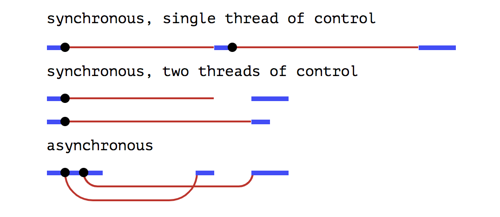

But Java 8 has introduced a new feature called CompletableFuture which can be extensively used in case of implementation 
of asynchronous programming in Java.

####What is CompletableFuture and how is it different from Future:
According to Oracle documentation, a CompletableFuture is a Future that may be explicitly completed 
(setting its value and status), and may be used as a CompletionStage, supporting dependent functions and actions that 
trigger upon its completion.

When two or more threads attempt to complete, completeExceptionally, or cancel a CompletableFuture, 
only one of them succeeds.

<b>CompletableFuture class belongs to the java.util.concurrent package.</b>
Signature:

    public class CompletableFuture<T> extends Object  implements Future<T>, CompletionStage<T>

CompletableFuture implements Future and CompletionStage interfaces and provides a huge set of convenience methods for creating, chaining and combining multiple Futures. It also has a very comprehensive exception handling support. CompletableFuture overcomes below limitations of Future:

 1. Futures can not be explicitly completed even when it has encountered an exception scenario.
 2. Future provides a get() method which blocks until the result is available. further action can not be performed on a 
    Future’s result without blocking the primary application thread.
 3. Asynchronous workflows can not be created by chaining multiple Futures together.
 4. Futures which are running in parallel, can not be combined together.
 5. Future API does not have any exception handling construct.

###CompletableFuture.runAsync() :

If we want to run some background task asynchronously and do not want to return anything from that task, that is an ideal use-case of CompletableFuture.runAsync() method. It takes a Runnable object and returns CompletableFuture<Void>.

###CompletableFuture.supplyAsync() :

On contrary to the above use-case, if we want to run some background task asynchronously and want to return anything from that task, we should use CompletableFuture.supplyAsync(). It takes a Supplier<T> and returns CompletableFuture<T> where T is the type of the value obtained by calling the given supplier.

### References
  1. https://www.callicoder.com/java-8-completablefuture-tutorial/
