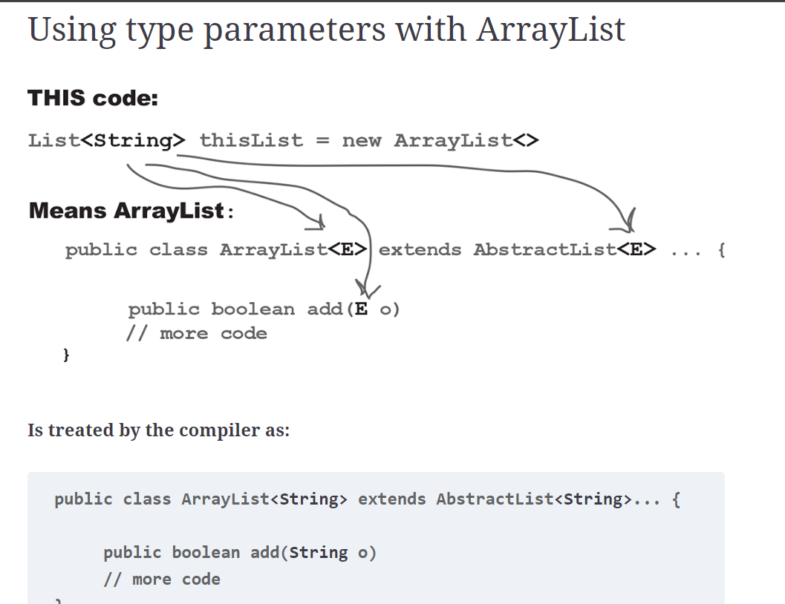

In other words, the “E” is replaced by the real type (also called the type parameter) that you use when you create the 
ArrayList. And that’s why the add() method for ArrayList won’t let you add anything except objects of a reference type that’s compatible with the type of “E.” So if you make an ArrayList<String>, the add() method suddenly becomes add(String o). If you make the ArrayList of type Dog, suddenly the add() 
method becomes add(Dog o).

## Using generic METHODS

1. Using a type parameter defined in the class declaration
  
  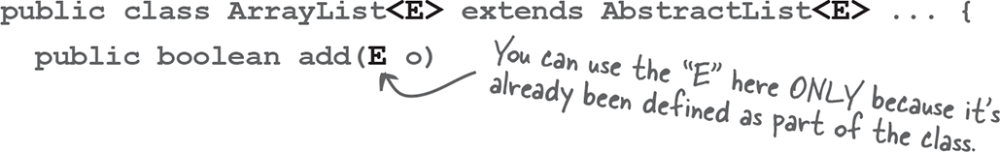

When you declare a type parameter for the class, you can simply use that type any place that you’d use a real class or interface type. The type declared in the method argument 
is essentially replaced with the type you use when you instantiate the class.

2. Using a type parameter that was NOT defined in the class declaration

   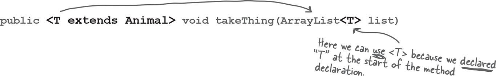

If the class itself doesn’t use a type parameter, you can still specify one for a method, by declaring it in a really unusual (but available) 
space—before the return type. This method says that T can be “any type of Animal.”


## Here’s where it gets weird...

This:

`public<T extends Animal> void takeThing(ArrayList<T> list)`

Is NOT the same as this:

`public void takeThing(ArrayList<Animal> list)`


The first one, where <T extends Animal> is part of the method declaration, means that any ArrayList declared of a type that is Animal, or one of Animal’s subtypes (like Dog or Cat), is legal. So you could invoke the top method using an ArrayList<Dog>, ArrayList<Cat>, or ArrayList<Animal>.

But...the one on the bottom, where the method argument is (ArrayList<Animal> list) means that only an ArrayList<Animal> is legal. In other words, while the first version takes an ArrayList of any type that is a type of Animal (Animal, Dog, Cat, etc.), the second version takes only an ArrayList of type Animal. Not ArrayList<Dog> or ArrayList<Cat>, but only ArrayList<Animal>.

And yes, it does appear to violate the point of polymorphism, but it will become clear when we revisit this in detail at the end of the chapter. For now, remember that we’re only looking at this because we’re still trying to figure out how to sort() that SongList, and that led us into looking at the API for the sort() method, which had this strange generic type declaration.

For now, all you need to know is that the syntax of the top version is legal and that it means you can pass in a ArrayList object instantiated as Animal or any Animal subtype.

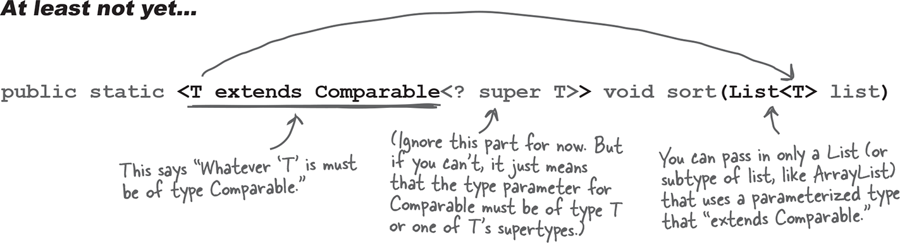

## In generics, “extends” means “extends or implements”

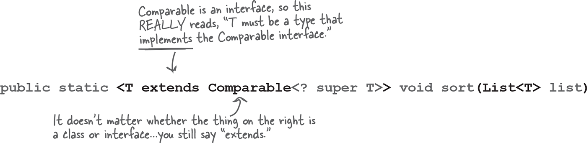


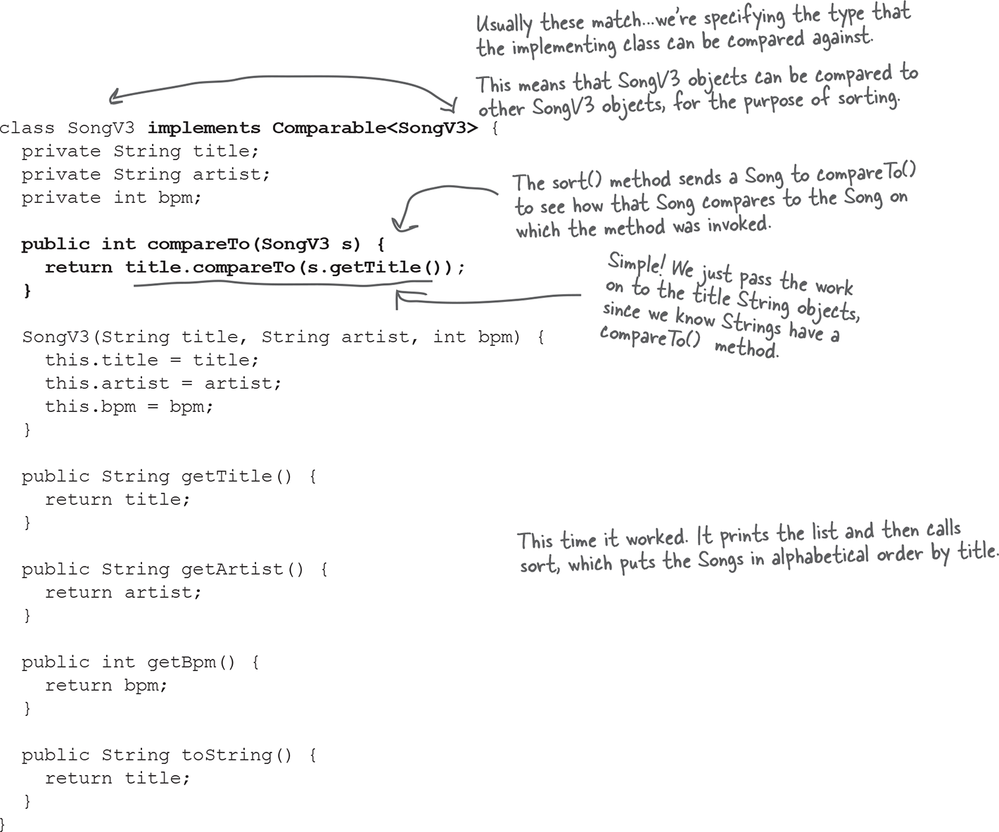


The API docs for class Object state the rules you MUST follow:

If two objects are equal, they MUST have matching hash codes.

If two objects are equal, calling equals() on either object MUST return true. In other words, if (a.equals(b)) then (b.equals(a)).

If two objects have the same hash code value, they are NOT required to be equal. But if they’re equal, they MUST have the same hash code value.

So, if you override equals(), you MUST override hashCode().

The default behavior of hashCode() is to generate a unique integer for each object on the heap. So if you don’t override hashCode() in a class, no two objects of that type can EVER be considered equal.

The default behavior of equals() is to do an == comparison. In other words, to test whether the two references refer to a single object on the heap. So if you don’t override equals() in a class, no two objects can EVER be considered equal since references to two different objects will always contain a different bit pattern.

a.equals(b) must also mean that

a.hashCode() == b.hashCode()

But a.hashCode() == b.hashCode()

does NOT have to mean a.equals(b)


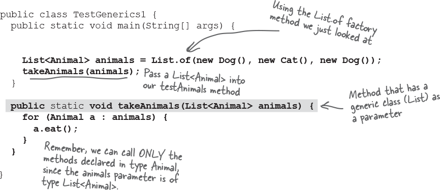

Compiles and runs just fine


But will it work with List<Dog>?
A List<Animal> argument can be passed to a method with a List<Animal> parameter. So the big question is, will the List<Animal> parameter accept a List<Dog>? Isn’t that what polymorphism is for?

Passing in List<Dog>

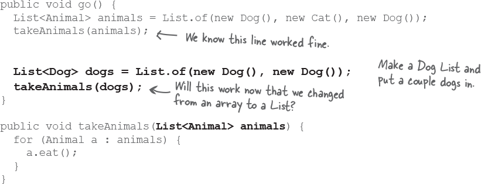

When we compile it:

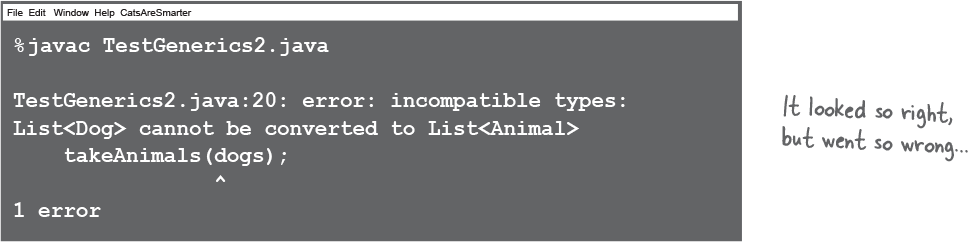


What could happen if it were allowed...?

Imagine the compiler let you get away with that. It let you pass a List<Dog> to a method declared as

```
public void takeAnimals(List<Animal> animals) {

 for (Animal a : animals) {
     a.eat();
   }

}

```

There’s nothing in that method that looks harmful, right? After all, the whole point of polymorphism is that anything an Animal can do (in this case, the eat() method), a Dog can do as well. So what’s the problem with having the method call eat() on each of the Dog references?

There’s nothing wrong with that code. But imagine this code instead:

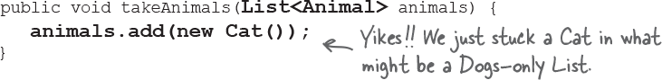

So that’s the problem. There’s certainly nothing wrong with adding a Cat to a List<Animal>, and that’s the whole point of having a List of a supertype like Animal—so that you can put all types of animals in a single Animal List.

But if you passed a Dog List—one meant to hold ONLY Dogs—to this method that takes an Animal List, then suddenly you’d end up with a Cat in the Dog list. The compiler knows that if it lets you pass a Dog List into the method like that, someone could, at runtime, add a Cat to your Dog list. So instead, the compiler just won’t let you take the risk.


### If you declare a method to take List<Animal>, it can take ONLY a List<Animal>, not List<Dog> or List<Cat>.

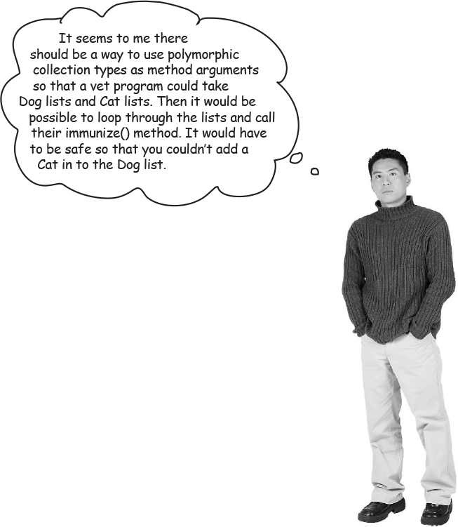

We can do this with wildcards:

It looks unusual, but there is a way to create a method argument that can accept a List of any Animal subtype. The simplest way is to use a wildcard.

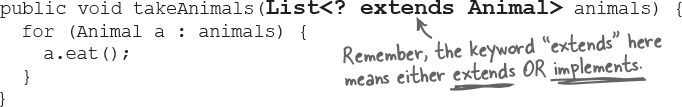

So now you’re wondering, “What’s the difference? Don’t you have the same problem as before?”

And you’d be right for wondering. The answer is NO. When you use the wildcard <?> in your declaration, the compiler won’t let you do anything that adds to the list!

```
When you use a wildcard in your method argument, the compiler will STOP you from doing anything that could hurt the list referenced by the method parameter.

You can still call methods on the elements in the list, but you cannot add elements to the list.

In other words, you can do things with the list elements, but you can’t put new things in the list.

```

#### Q: Back when we first saw generic methods, there was a similar-looking method that declared the generic type in front of the method name. Does that do the same thing as this takeAnimals method?

A: Well spotted! Back at the start of the chapter, there was a method like this:

 <T extends Animal> void takeThing(List<T> list)

We actually could use this syntax to achieve a similar thing, but it works in a slightly different way. Yes, you can pass List<Animal> and List<Dog> into the method, but you get the added benefit of being able to use the generic type, T, elsewhere too.

### Using the method’s generic type parameter:

What can we do if we define our method like this instead?

`public <T extends Animal> void takeAnimals(List<T> list) { }`

Well, not much as the method stands right now, we don’t need to use “T” for anything. But if we made a change to our method to return a List, for example of all the animals 
we had successfully vaccinated, we can declare that the List that’s returned has the same generic type as the List that’s passed in:

`public <T extends Animal> List<T> takeAnimals(List<T> list) { }`

When you call the method, you know you’re going to get the same type back as you put in.

```
List<Dog> dogs = List.of(new Dog(), new Dog());
List<Dog> vaccinatedDogs = takeAnimals(dogs);

List<Animal> animals = List.of(new Dog(), new Cat());
List<Animal> vaccinatedAnimals = takeAnimals(animals);
```

## The List we get back from the takeAnimals method is always the same type as the list we pass in.

If the method used the wildcard for both method parameter and return type, there’s nothing to guarantee they’re the same type. In fact, anything calling the method has almost no idea what’s going to be in the collection, other than “some sort of animal.”

```
public void go() {
  List<Dog> dogs = List.of(new Dog(), new Dog());
  List<? extends Animal> vaccinatedSomethings = takeAnimals(dogs);
}

  public List<? extends Animal> takeAnimals(List<? extends Animal> animals) { }```
```

Note:

Using the wildcard (“? extends”) is fine when you don’t care much about the generic type, you just want to allow all subtypes of some type.

Using a type parameter (“T”) is more helpful when you want to do more with the type itself, for example in the method’s return.

