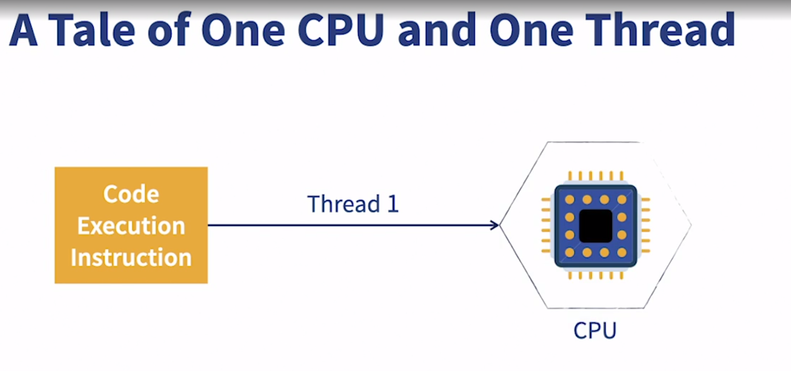
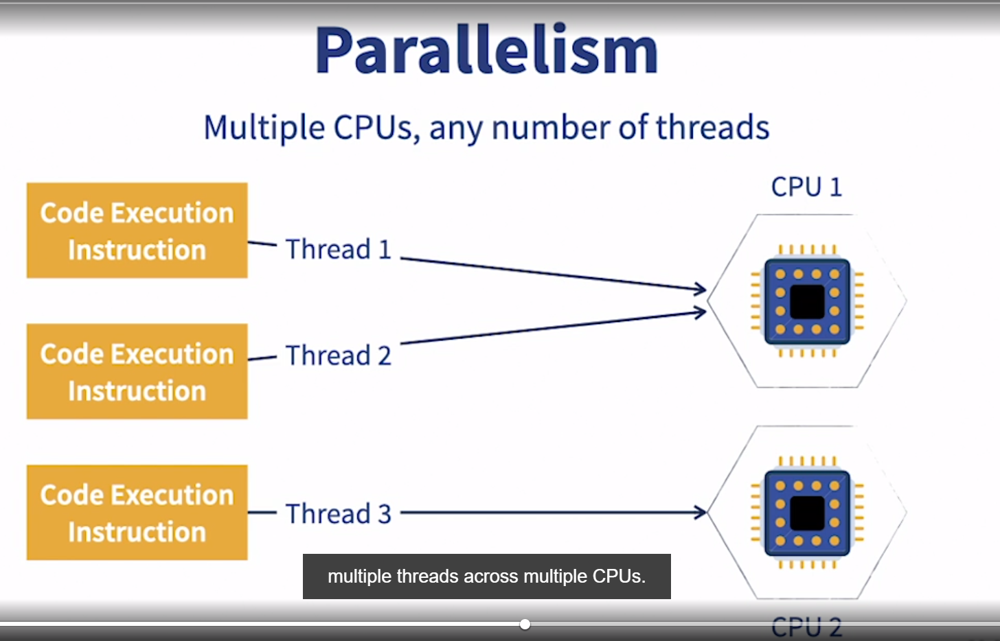

### Parallelism vs. concurrency

- [Instructor] You've probably heard someone conflate these two terms, concurrency and parallelism. Let's check them out. 
The machine that your code runs on contains at least one CPU or core. Otherwise, it's just an empty metal box. The whole point of programming is to send instructions to that CPU to carry out some calculations or operation. 

- Concurrency is the act of making that one CPU execute different instructions in separate threads. 
The thing with concurrency is that in practice, only one thread can be operated on by the CPU at any given time. 

- The CPU is able to create the illusion of doing many things at the same time by very quickly switching between the many threads that are waiting for CPU time so that to you, the programmer or end user, it looks like simultaneous execution. 
  Concurrency is a tale of one CPU or processor. 

- Parallelism is the tale of multiple CPUs or cores. This is the stuff that enterprise-strength computing is made of. 
Parallelism is what you get when you're able to execute multiple threads across multiple CPUs. 

- This way, the threads don't have to share time on one CPU. They are truly being executed literally at the same time, no time-slicing gimmicks. 
The difference is way more than semantic.

    How your application behaves using programming constructs like lambdas, streams, and reactive programming might vary under the two threading approaches. 

    The distinction gets even more crucial when you're in a virtualized environment like Docker. Some of the disappointment 
    we find in latency and throughput can come from unrealistic expectations of our underlying hardware. 

    Knowing how many cores or CPUs you'll have at your disposal is very key to designing and implementing high throughput applications. 
    This course is titled for concurrency but I will be touching on parallelism along the way because there's no parallelism without concurrency. So strap on your multi-threading boots and let's get weird with threads.