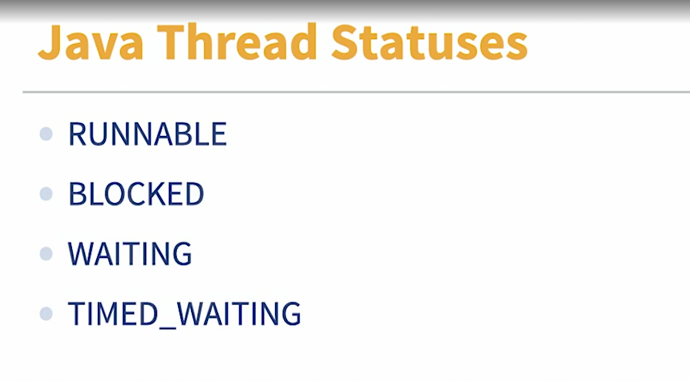

Challenge: Find the sleeping method

(upbeat music) - [Tayo] How about you play detective with your JVM? First, please go ahead and import the exercise package for this video into your favorite IDE. When you're done, put your detective hat on. In this exercise package, please locate the com.linkedin.learning.samples.troubleshootlatencyconch application class. No peeking. Don't open any other files inside the project. Running the main method in this class will kick off a process of generating and printing anagrams to the console, but there's a catch. One or more of the executing methods goes to sleep during the process of generating the anagrams. Your mission, should you choose to accept it, is to capture thread dumps and identify the method in which the thread falls asleep. We're counting on you. Find sleeping beauty, good luck.

Solution: Find the sleeping method
Selecting transcript lines in this section will navigate to timestamp in the video
(upbeat music) - [Instructor] Welcome back, detective. So how did it go? You know what, let me give it a try. So let's go into my IDE here, and we're running Intellij. Here's my TroubleshootLatencyConcApplication, here's the main method, going to right-click and run that method. Now, with the code running, I should only need to nip over to my command prompt window and find the ID of the Java process being run by my Intellij. Cut over to the command prompt. Here we are. Now, because Intellij itself is a Java application, it will always have its own Java process. So we're just going to run tasklist /fi filter by imagename equals java.exe. There we have it, three Java processes. You also probably have other Java applications running on your machine, so that could make it more challenging to narrow down which specific process is holding the sample application. I'm just going to select the latest process here, and run jcmd. So jcmd, process ID 9900, Thread.print, I want it piped out to a file named tayos_thread_dump.tayo. Wonderful file extension. And you can repeat this process for as many thread dumps as you'd like to capture. So I've gone ahead and pre-captured a bunch of thread dumps. Here we have it. I have one, two, three, four, five, six thread dumps. Now what am I looking for here? I'm looking for a thread literally sleeping on the job. And so I can just search this wall of text for the word sleep. So look for sleep here. Well, doesn't seem to exist in this thread dump. So I'll go to the next one that I captured. So look for the word sleep here, ah, and there it is. The state is TIMED_WAITING parentheses, sleeping. It is literally sleeping because I made it do so. I can also see the name of the thread here. Main, from the main method. I can also see how long the thread was executing for here in the elapsed field, for 62.18 seconds. So a little over a minute. I can also see the amount of CPU time that this thread consumed, so here I have it, CPU 359.38 milliseconds. Crucially, I can see the stack trace showing the method that's causing this thread to waste so much time. Here we have it, this is a stack trace here. So we're at the scramble with for loop method on line 81. This is the point at which the whole application grinds to a halt because this thread is being forced to sleep. Pretty neat, huh? There is so much more information that you can glean from a timely thread dump. I highly recommend you check out the documentation on jcmd for more command options and features. Congratulations on your dump.

Identify blocked threads in thread dumps
Selecting transcript lines in this section will navigate to timestamp in the video
- [Teacher] So you've captured a couple of thread dumps. Remember, one thread dump, usually isn't any good, but now what? Your department is looking at you to figure out why loading a page is taking a long time or something. First, you'll need to understand some of the key pieces of information in a thread dump. So, in the thread dump, you can find the name of the thread, it's ID, it's daemon status, the thread ID according to the operating system which is separate from its ID within the JVM, it status, the timing parameter that has the CPU and the elapsed time. Fun fact, this was contributed to the OpenJDK by the group over at SAP. So how can you use this to troubleshoot a thread dump? At the most basic level, you want to be sure that the word blocked isn't anywhere in any of the thread dumps you have. Here's why. Threads in Java have a couple of statuses, but for the purposes of troubleshooting latency and throughput problems, you're mostly interested in these ones. So you're interested in finding out the runnable threads, the blocked threads, the waiting threads, and the timed_waiting threads. Now heads up. The thread dumps will contain threads that you shouldn't concern yourself with. It's sometimes tricky to know which ones to ignore, but in general, when a thread is marked as a daemon thread, such as here, mark as daemon in this thread dump, when it's marked as a daemon thread, it's an internal JVM thread. So don't let such threads throw you off while you're investigating. Inside the thread dump, you should be looking for threads in these statuses. If you find blocked in the thread dump, that's a red flag. It means that a thread is enabled to proceed processing for some reason. Now, how long it's been in that state is what's going to make all the difference. Also pay attention to the time fields. Here we have it. We've got the CPU time. We've got the elapsed time. Now, from left to right, we'll see as the timing increases. So pay attention to the main thread here. It got the CPU time of 359 milliseconds and the elapsed time at 62.18 seconds. The next dump that I captured, you see the time increase and on it goes. You can see that time continues to increase even if the CPU time is not increasing. So it means that this thread just spent some time sitting around or sleeping in this case, doing nothing. So in essence, the time figures here, they are accumulative. So that as you go across each thread dump that you've captured, you can see a running tally of how long their thread has been doing whatever it's doing. Bless the folks at SAP. For each thread dumps you have, look for threads with the same status across multiple thread dumps and with a timing increasing. The objective here is to conclusively state that a specific thread you're interested in was stuck in a state for an unusual amount of time. You generally should work your way through these four statuses, roughly in this order. Now, a thread could be stuck in a given status for many different reasons. The most straightforward troubleshooting you'll find, is when you can just look up the stack trace such as here, and it states clearly that this is what this thread is trying to do that's taking so long. In this example, this thread is trying to execute the scramble with four loop method, and that's taken a while. Now, all of this is doing things the hard way. Let me be clear. It's important to learn how to do it this way because in production settings, you might not have the luxury of using fancy tooling. If you do have the luxury of tools, there's good old jstack.review. The comparison feature here is really neat. At a glance, I can see what's changed across two or more thread dumps, giving me a quicker path to finding long running threads that may be blocked. I should mention here that I'm not affiliated with jstack or really any of the online tools that have highlighted in this course. So, there is some risk to making a thread dumps publicly visible in any form. A malicious entity could use your thread dumps to figure out what libraries are used by your enterprise, and subsequently use those as an attack vector. To that end, a tool like J VisualVM could be used as a more secure alternative to reviewing thread dumps. You only lose all of the graphical finesse of the online tools, and you have to do all of the analysis yourself. Buyer beware.