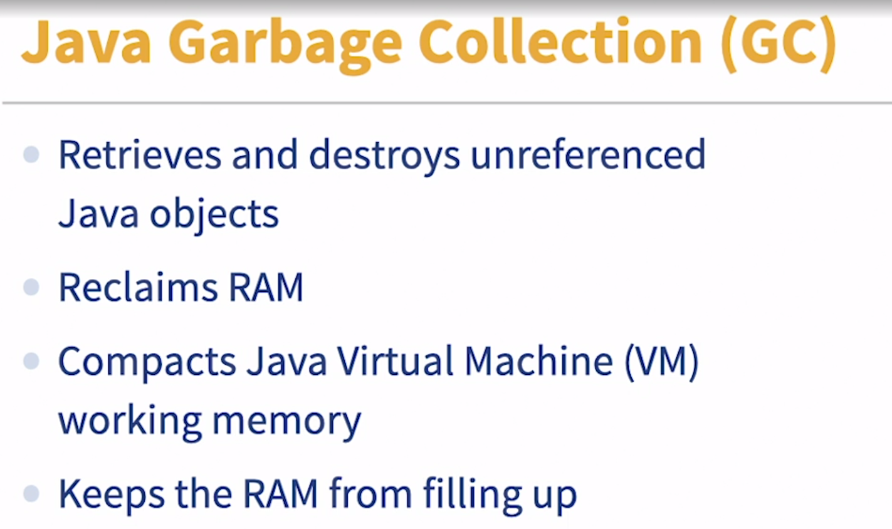
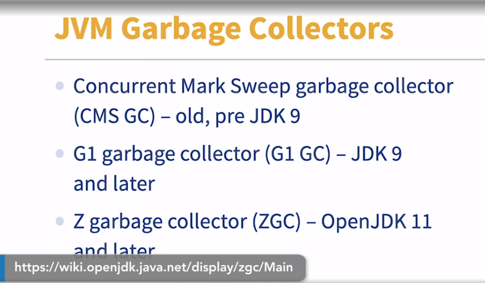

### Garbage collection

- [Instructor] Does your application or microservice seem to freeze at somewhat regular intervals? Do things seem to suddenly stop working under high volume? Does your server's CPU utilization suddenly spike for no apparent reason? 

- What's your favorite spicy food level? The answers to these questions and more might be garbage collection. Not the spicy food one though. That's absolutely nothing to do with garbage collection. I just really like spicy food. Story time. I was interviewing with a large global fintech firm a couple of years ago. One of the technical questions on that interview was an actual problem they had faced in production. At specific times of the day, one of their applications will basically grind to a halt for several minutes and initially they had no idea why. I had a hunch garbage collection. Here's garbage collection described in brief. It's the process of cleaning up the physical RAM space occupied by unused Java objects that have been accumulated in the course of running your Java application. Garbage collection is a pretty big deal and getting it right is crucial. It's a configuration item for the JVM and you should consider the right garbage collector configuration for your specific deployment scenario. We'll talk about some of the options a little later. Bottom line is this. You want to clean up your RAM but you don't want to spend too long doing it. You can best observe the effects of garbage collection with APM, that's application performance monitoring tools, like Datadog, New Relic, and a number of embedded JDK utilities. There's a great deal of flexibility in preventing this flavor of performance problem. Various successors to JDK 8 have introduced increasingly efficient garbage collectors. So you've got the CMS, Concurrent Mark Sweep garbage collector is rather old and deprecated at this time. You've got the G1 or Garbage-First garbage collector from JDK 9 and later. 

- You've got the Zed GC, that's Zero Garbage Collector from JDK 11 and later. All told, garbage collectors will block all other threads in the JVM while they do their thing. The questions to ask are, how long would it block the JVM for? And how much RAM will be freed up? It's a balancing act, but one that can yield dramatic results, if the right balance is achieved. As I said before, your mileage will vary. What you need to be aware of is when garbage collection is a reason why your users can't have access to your application, Oracle has fantastic documentation here, that will guide your decision on what to do with your garbage collection. Shout out to Oracle. Some of the best documentation about Java comes straight from the source. Brilliant stuff and it's free.