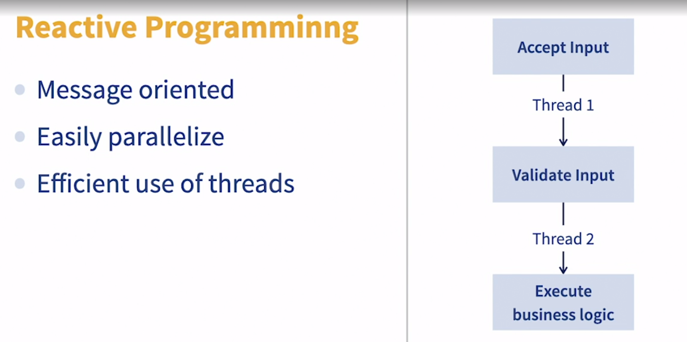

### Resource chokepoints and long-running operations

- An age old saying in technology goes something like this. Just throwing more people at a project, will not necessarily make it complete any faster. Some things, just take time. In our restaurant, we can't boil eight eggs any faster than we'll boil one. All this to say, sometimes, the source of increased latency or reduce throughput, as a black box resource or an operation that takes a minimum amount of time. A typical enterprise application connects the databases, message queues, web services, the file system, and maybe even the kitchen sink. In many scenarios, these black box systems will take as long as they need, to do what they need to do. There's only so much you can optimize the performance of a query. Bottom line is this, many threads are trying to interact with a third party, black box system. And sometimes, it'll take a long time for the work in there to complete. So for some clients or users of a Java application, it's going to look like a latency problem. And then you hear questions like, Why is it taking so long to save my user information? Why is it taking so long to retrieve my files? And that's all obviously unpleasant. But now, depending on what the database is doing and any other weird business going on in your application architecture, there probably isn't a lot you can do about it. A large file for example, will generally take some time to download. So don't focus too much on what you can't fix. Prioritize instead of what you can fix. Sometimes it's like trying to pick, which is your favorite child. You're going to have to decide, whether it's better to deprive a lot of users, access to your service as a whole, or, make a smaller subset of your users wait for a specific operation, to finish executing. I typically recommend the latter. Prioritize throughput over latency in these scenarios where you have to pick just one. In many instances, there might not be a lot you can do to improve the latency. What you certainly don't want is to allow a latency problem to become a throughput problem. Remember our beloved restaurant kitchen, a single meal is going to take a fixed amount of time to cook. You can't change that. You can now make it worse by having just one stove burner to cook meals on. It helps to have multiple stove tops, to cook on. Improving the number of eggs you can cook concurrently. Even if you can't cook them faster individually. Out of this philosophy, we get the concept of resource pooling. Pooling is a design approach where you can pre-create and store multiple instances of expensive and or bottleneck prone components. I'm talking about database connections, messaging queue connections, network connections, or even just pools of threads. Yes, threat pools are a thing This doesn't eliminate the need to narrow down and eliminate issues related to say, inefficient SQL queries, and inefficient use of hibernate entities and features and networking related optimizations, like bandwidth, et cetera. Eventually these problems will catch up with you, if left unaddressed. Now, one of my favorite techniques, for improving the throughput of my applications, is using reactive programming and frameworks wherever I can. Reactive programming fundamentally works like this. If you think of your application as a series of steps, reactive programming frameworks, typically allow different threads to handle different steps. So, in a rest web service framework like spring boot, for example, using spring boots, reactive and points means that, one thread will accept connection requests from a service client. It can then hand off the request to a separate thread, to execute the business logic. Freeing up, that first thread to continue accepting requests. A non-reactive model will use the same thread from beginning to end, potentially reducing throughput. Some reactive frameworks you'll find will be in the Jax-RS specification, using the Jersey implementation for example. You can find reactivity in Spring Boot, the WebFlux module. You can have reactivity with the Vert.x API, and can have reactivity with RXJava. The key technique in figuring out whether you have bottlenecks in your code, is micro benchmarking. Think of micro benchmarking as a way to run a stopwatch around specific sections of your code. Open JDK version 12, introduce the Java micro benchmarking harness or jmh, as a clean, reliable way to execute meaningful benchmarks, and I cannot recommend it enough. So to recap, use resource pools, judiciously. First to improve throughput, then possibly improve latency. Consider reactive programming, wherever you have multiple CPU's and business logic, that can be broken down into independent steps in a pipeline.