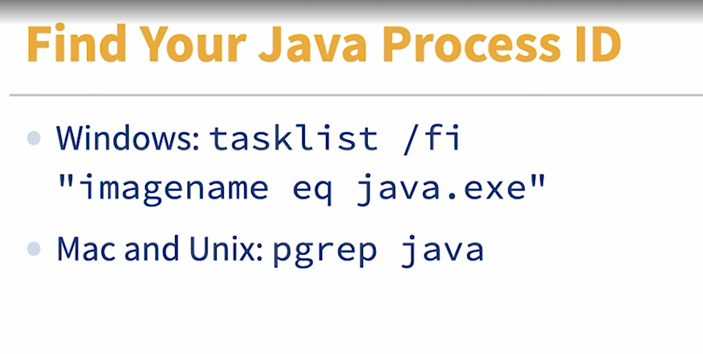
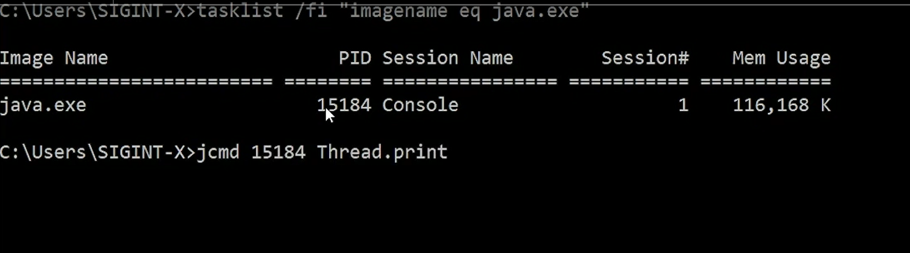
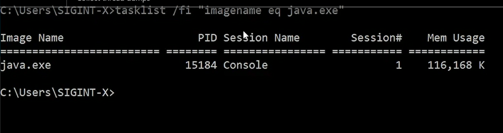

Collect thread dumps

Selecting transcript lines in this section will navigate to timestamp in the video
- [Narrator] Let'                         s go over what a thread dump is first. A thread dump is a snapshot of all the threads that the Java process is running. It shows you the status of those threads and a handful of useful tidbits, about the state of things in running Java application. Now that sounds a little more complicated than it is, but I assure you, it's just debug level logging for the JVM. Why would you want a thread dump? Primarily, to see what individual threads inside your JVM are doing at a given moment. You get to see the methods that each running thread is executing and the status of a thread. You also get to see the locks that each thread is holding, very useful for detecting deadlocks between threads. Now, there are a couple of ways to collect thread dumps, so we can have the Java Mission Control or JMC do that for us. I can use the Java Flight Recorder or JFR, I can use the jcmd utility, I can use the jstack utility, I can use the jvisualvm utility. All of these are utilities that ship with the JDK and they roughly straddle the world of reactive and proactive monitoring tools. Now, let's look at how to use jcmd to collect a thread dump. The first thing to do is to find the process ID for the Java operating system process that we're interested in dumping threads from. The approach for getting the ID, will depend on your operating system. For Unix-based systems and Mac use pgrep, that means just type pgrep Java into your Command Prompt or your terminal window. I'm running a Windows based machine here, so I'm going to use the task list utility. Now I'm going to pop over to a command line window and type out tasklists/fi, that's the filtering command and then I supply the filter query and my filter query is imagename and it's going to filter by imagename equals eqjava.exe. So this ought to show me the Java processes running in my Windows machine, hit Enter, and there I have it. You'll find one Java exe for each application that's running in your operating system. With this ID, I can then go jcmd take the ID 15184 and Thread.print, I hit Enter and there I have it, my thread dump. The default behavior, as you can see, is are printed all to the screen, yuck! You can send the output of jcmd to a file however, like this. So exactly the same command jcmd, that same process ID and thread.print, but then I'm going to add the greater than sign to send it to a file of my choosing. So I'm just going to call it tayos_thread_dump.tayo, my preferred file extension hit Enter, and the content of the thread dump will be sent to that file, on my disc. In most cases though, to make useful logical deductions from thread dumps, you need a couple of them over a period of time. Think about it. One thread dump is a frozen snapshot of the JVM at that point in time, when there's a latency issue, you're talking about a thread or a group of friends that are doing something, over an unexpectedly long period of time. So, with say, five thread dumps collected over about eight to 10 seconds, you can then look for a thread or multiple threads that are blocked or waiting or doing the same thing over the span of those five threads. With that, you have an idea of where to start digging. At scale, manually analyzing a thread dump isn't practical, unique tools, stop me if you've heard that one before. Now, you can Google Java Thread Dump Analyzer and get a bunch of results. My top two candidates are jstack.review and Spotify Thread Dump Analyzer, yes, that's Spotify. The music streaming nerds, turns out, they take that tech very, very seriously, who knew? Let's have a look at jstack.review. Here we have jstack.review, you can start with a tour, you enter, or you put the contents of your thread dump into this text box, or you can upload the file directly. You can go here, there's a tour, it can show you all the various things that jstack.review can do. My favorite feature of jstack.review is how it's able to compare thread dumps, that comes really handy for the kind of time lapse comparison that's necessary for effective thread dump analysis. Remember how I said that comparing multiple thread dumps over a span of time, is the best way to really get value out of thread dumps, jstacked.review makes that a breeze with their thread dump comparison feature. Here's Spotify's analysis tool. It's a little bit barer bones than jstack.review, but it's just as powerful and puts a lot of analysis ability into your hand. You don't get the multithread dumb comparison feature here however. So, try both out and see which feels better for you.