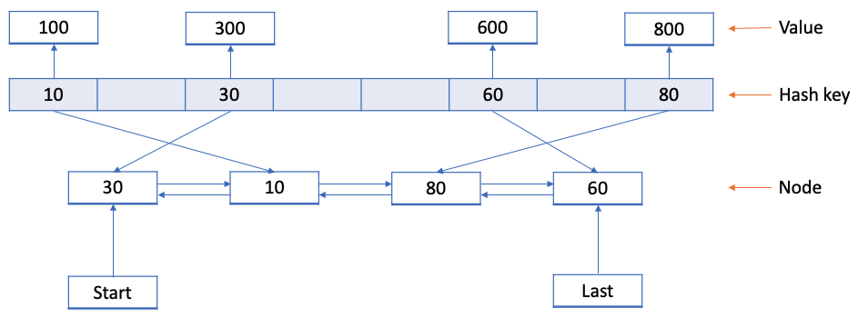

According to wikipedia, a cache is a hardware or software component that stores data so that future requests for that data can be served faster.

###Benefits:
Faster access of data in O(1)

Computation complexity once for the first time

###Types:
1. Memory cache
2. Database cache
3. Disk cache, etc

To create a cache, we can simply use a map / dictionary data-structure and we can get the expected result of O(1) for both get and put operation.
But, we can’t store everything in our cache. We have storage and performance limits.

A cache eviction algorithm is a way of deciding which element to evict when the cache is full. To gain optimized benefits there are many algorithms for different use cases.

1. Least Recently Used (LRU)

2. Least Frequently Used (LFU)

3. First In First Out (FIFO)

4. Last In First Out (LIFO) etc.

Here, we will use

1. HashMap to get and put data in O(1)

2. Doubly linked list

We are using doubly linked list to determine which key to delete and have the benefit of adding and deleting keys in O(1).

Initially we will declare a model to store our key-value pair, hit count and reference node to point previous and next node.

We also included hit count and miss count to determine the performance of our cache.

`Hit ratio = total hit / (total hit + total miss)`

For our put method

1. If key already exists, update the value
2. Otherwise, If size exceeds capacity
3. Delete existing node using appropriate strategy
4. Add new node in the top

###Least Recently Used (LRU)
Delete candidate is the oldest used entry.

1. The latest accessed node will be at the last end along with newly added items. 
   In this way, we can delete from the first easily.

###Least Frequently Used (LFU)
Delete candidate is the least accessed entry.

We have to sort items based on the frequency the nodes being accessed.
To avoid getting deleted, for each accessed items needs to reach top based on their frequency.

1. Iterated a loop, which swaps the node if the frequency is greater than it’s next node frequency.

###Reference
1. https://medium.com/analytics-vidhya/how-to-implement-cache-in-java-d9aa5e9577f2