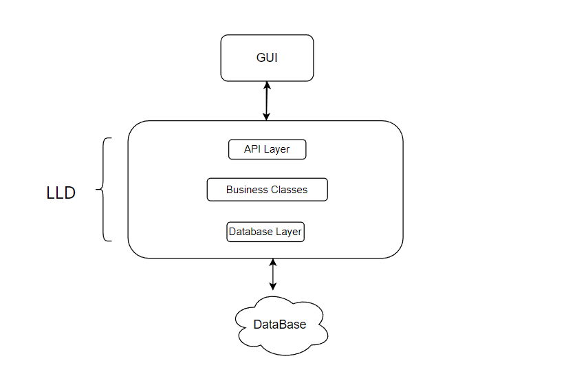
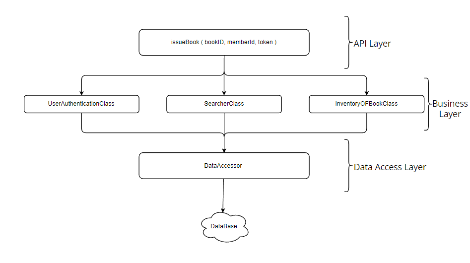

Library Management System - Requirements
Library Management System : Requirement
1. Assume we are Designing a Library Management system. So our first step towards a structured thinking Process is to gather Requirements.

2. Always write your requirements crystal clear.

3. Following are the key Requirements for our System.

Library consists of many Books and each book has its own attributes like BookName , AuthorName , PublicationDate.

A book can have multiple copies and each copy will have a unique ID.

Everyone should be able to search on the basis of the BookName and AuthorName and find out if there are available copies or not.

There are 2 types of USERS : Member and Librarian.

Librarians should be able to issue the book copies to members.

Librarians should be able to submit the book copies from members.

A member should be allowed to keep a book copy for a max of 30 days beyond which a fill shall be charged on per day basis.

Librarians should be able to add/remove book copies.

Librarians should be able to mark a member as blocked.

Librarians should be able to do a status check for a particular book-copy i.e. Who issued the book-copy and to whom the book was issued and when.
Figuring out the flows
1. Second Step for Designing the Library Management System is to Take a Look at Graphical User Interface (GUI) or the front-end part of the System .

2. We will look for the different functionality and API used in function calls to get the hints and ideas about our low level design and classes we needed.

3. In GUI, there will be a search box , hence we get idea that there should be following API  or function call

SearchBookByBookName( para… )
SearchBookByAuthorName( para… )
SearchMemberByMenberName(para…)

4. In GUI there must be an option for Adding a Book. Hence there should be an API for that purpose.

AddBook(id, token, para…)
5. In GUI there must be an option for Deleting a Book. Hence there should be an API for that purpose.

DeleteBook(id, token, para…)
6. In GUI there must be an option for Blocking a Member. Hence there should be an API for that purpose.

BlockMember(id, token, para…)
7. In GUI there must be an option for checking how many books are issued to a particular Member. Hence there should be an API for that purpose.

GetAllIssuedBook(id, token, para…)
8. In GUI there must be an option for Issue a Book. Hence there should be an API for that purpose.

IssueBook(id, token, para…)
9. As Interviews have a fixed amount of time , we might not be able to come up with Everything But whatever is crucial we must add it in our System while designing.

10. Now we have a pretty good idea of how we should start coding it out. We know that there are API which will be using some internal LLD modules and what might be the function of those modules.

**Structure**

1. Next step to build our library management system is to build the structure of the system.

2. LLD is contained between the GUI layer and DataBase Layer.

3. Any LLD can be Broken in three Layers

API Layer
Business Class Layer
DataBase Layer

4. Consider the Given Diagram

5. In the API layer we have an API issueBook(para) , which we will use to issue books.

6. To issue a book , according to business logic , only admin or officials should be able to issue a book , hence we have UserAuthenticationClass in our business logic layer.

7. Same goes for searcherClass and InventoryOFBookClass. According to business logic any member (Admin or User) should be able to search for a desired book.

8. Any request from the business logic layer (example : searching a book , authenticating credentials ) comes to the data access layer where the request is transformed into a Proper Query Format required to search in the database .

9. Our Classes and logics do not know about the database we are using. It can be SQL or maybe NoSQL. Hence for proper coordination data access layer converts the request into the correct frame or query for further process.