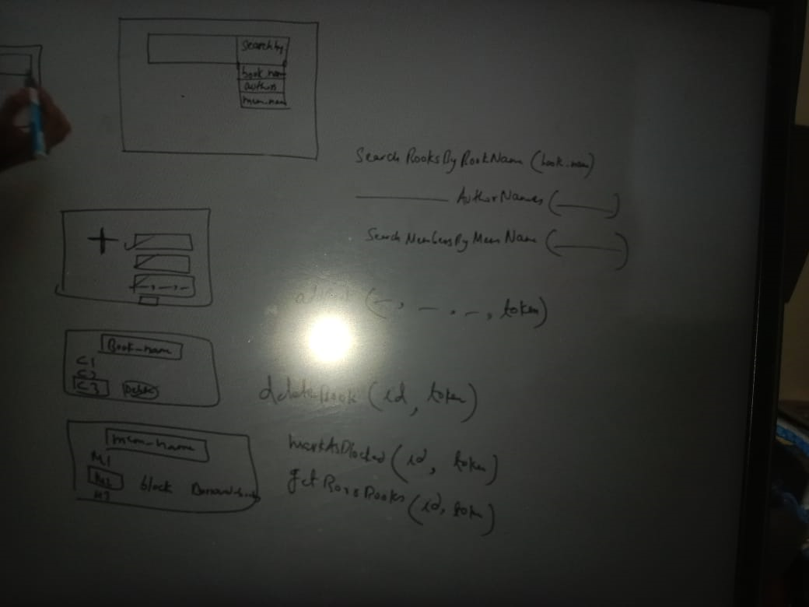

Step : 1 ->
Requirements:
 - Library consists of many books and each book has its own attributes: name, authors, publicationDate
 - A book can have multiple copies and each copy has a unique ids
 - Everyone should be able to search on the basis of bookName and authorName and findOut if there are available copies.
 - there are two type of users Member and librarian
 - Librarian should be able to issue book to the members
 - Librarian should be able to submit book from member
 - Member should be allowed to keep book copy for a max 30 days beyond which a fine shall be charge on the per day basis.
 - Librarians should be able to add/delete book copies.
 - Librarian should be able to mark a member as block.
 - Librarians should be able to do status check for a book-copy (who issues?). and check the book copies issue by a particular member.

Step: 2 -> 

APIs:
 1- search by {author, bookNames, category)
 2- searchMember{ name,
 3-  Librarian(should allowed to add new book, issue book and return back book)

 4- Issue Book

Select member -> Select Book --> issued By  hist issued

5-> find Borrowed Books  -> select book and click --> return that issued book by member

6 -

